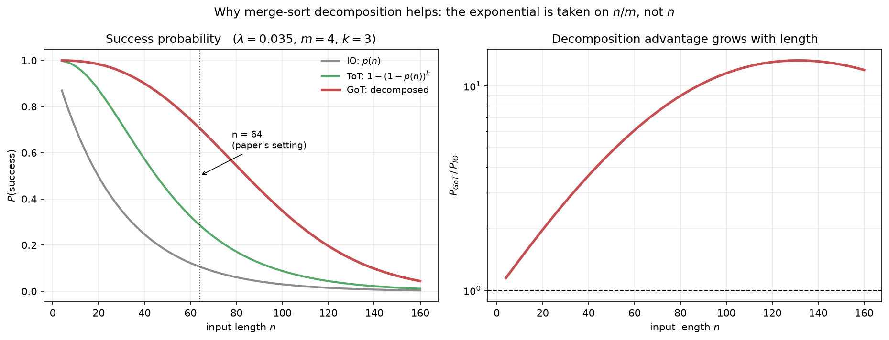
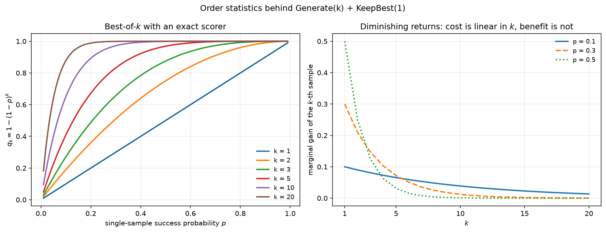
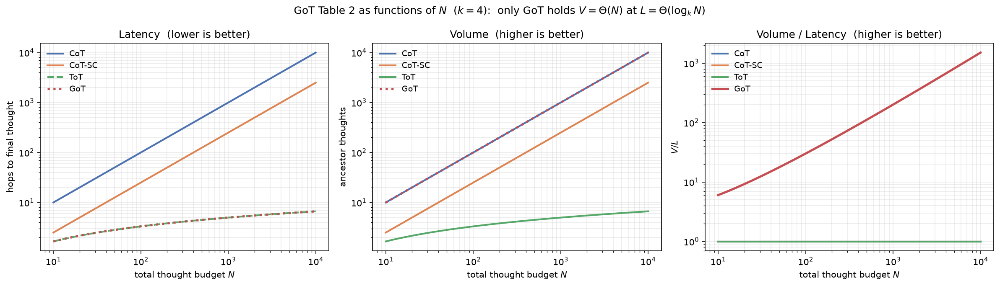
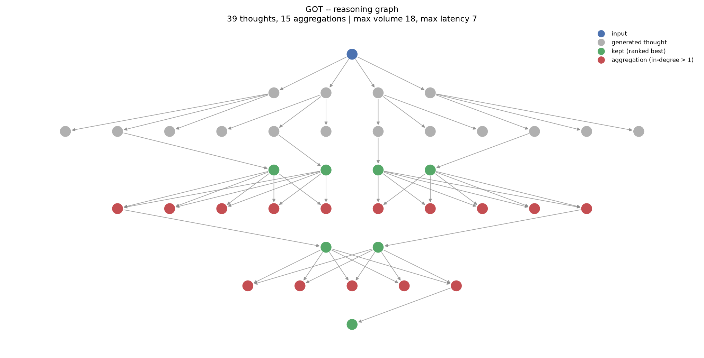
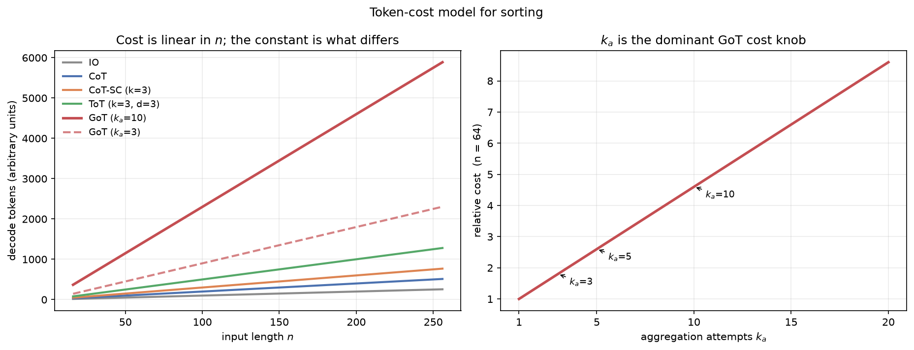

# explanation.md — Mathematical Deep Dive and Design Rationale

This document develops the theory behind the four papers **formally**, derives the
results rather than quoting them, and records why the implementation is built the way
it is.

Reading order follows the project instructions, and it is the right one: each paper is a
direct response to a mathematical limitation of the previous.

```
Chain-of-Thought  →  Tree of Thoughts  →  Graph of Thoughts
   (2022)               (2023)                (2024)
      │                                          ▲
      └──────── Multimodal-CoT (2023) ───────────┘
                (orthogonal: adds vision, not structure)
```

**Contents**

**New to LLMs? Start with section 0.**

0. [Start here — LLMs in fifteen minutes](#0-start-here--llms-in-fifteen-minutes)
1. [Notation](#1-notation)
2. [The autoregressive bottleneck — stated formally](#2-the-autoregressive-bottleneck--stated-formally)
3. [Paper 1 — Chain-of-Thought](#3-paper-1--chain-of-thought)
4. [Paper 2 — Tree of Thoughts](#4-paper-2--tree-of-thoughts)
5. [Paper 3 — Multimodal Chain-of-Thought](#5-paper-3--multimodal-chain-of-thought)
6. [Paper 4 — Graph of Thoughts](#6-paper-4--graph-of-thoughts)
7. [Why decomposition works — the error model](#7-why-decomposition-works--the-error-model)
8. [Best-of-k and the role of exact scoring](#8-best-of-k-and-the-role-of-exact-scoring)
9. [The latency–volume theorem, with proof](#9-the-latencyvolume-theorem-with-proof)
10. [The scoring functions — formal properties](#10-the-scoring-functions--formal-properties)
11. [Cost model](#11-cost-model)
12. [Glossary](#12-glossary)
13. [Paper → code map](#13-paper--code-map)
14. [Implementation decisions](#14-implementation-decisions)
15. [Bugs found, and what they taught me](#15-bugs-found-and-what-they-taught-me)
16. [What I verified, and what I did not](#16-what-i-verified-and-what-i-did-not)
17. [The GoT paper, read section by section](#17-the-got-paper-read-section-by-section)
18. [Datasets — which ones, and where they come from](#18-datasets--which-ones-and-where-they-come-from)
19. [Models and vLLM](#19-models-and-vllm)
20. [GPU replication runbook](#20-gpu-replication-runbook) — plain server **or** SLURM cluster
21. [The algorithm for building nodes and edges](#21-the-algorithm-for-building-nodes-and-edges)
22. [The replication protocol](#22-the-replication-protocol)

---

## 0. Start here — LLMs in fifteen minutes

*This section assumes no background at all. If you already know what a token, a prompt
and a temperature are, skip to [§1](#1-notation).*

### 0.1 What a language model actually does

Strip away the marketing and a large language model (LLM) does exactly one thing:

> **Given a piece of text, predict the next word.**

That is the whole job. You give it `"The capital of France is"` and it produces a
probability distribution over everything that could come next — `" Paris"` at 0.92,
`" a"` at 0.01, `" located"` at 0.005, and so on for every word it knows. It picks one,
sticks it on the end, and then predicts the next word from the new, longer text. It
repeats until it decides to stop.

```
"The capital of France is"           ->  " Paris"
"The capital of France is Paris"     ->  "."
"The capital of France is Paris."    ->  <stop>
```

This is called **autoregressive** generation — "auto" (self) + "regressive" (feeding
back into itself). Everything in all four of your papers follows from this one
mechanism, so it is worth being comfortable with it.

### 0.2 Tokens, not words

The model does not work in words. It works in **tokens** — chunks of text that are
roughly 3–4 characters. Common words are one token; rare words are split up.

```
"unbelievable"   ->  ["un", "bel", "iev", "able"]                        4 tokens
"the"            ->  ["the"]                                             1 token
"[3, 7, 0, 2]"   ->  ["[", "3", ",", " 7", ",", " 0", ",", " 2", "]"]    9 tokens
```

Why you care: **tokens are the unit of both cost and time.** A cloud API bills per
token. On a GPU, every single token requires one full pass through the network. So
"how many tokens did this scheme use" *is* the cost question, and it is the column our
benchmark prints as `tokens`.

Rule of thumb: 1 token ≈ 0.75 English words. A 64-number list is roughly 130 tokens.

### 0.3 The prompt and the context window

The **prompt** is the text you feed in. The **context window** is the maximum amount of
text the model can hold at once — prompt plus generated output together. GPT-3.5 in the
GoT paper used 4,000 tokens; Llama-3.1 allows 128,000.

This is a hard wall. If your prompt plus the answer exceeds it, the model either errors
or silently forgets the beginning. It is one reason decomposition helps: four small
prompts always fit, one huge prompt may not.

### 0.4 Training versus inference — and why we only do the second

| | Training | Inference |
|---|---|---|
| What happens | The model's weights $\theta$ are changed | Weights are frozen; text goes in, text comes out |
| Cost | Millions of dollars, thousands of GPUs | Fractions of a second on one GPU |
| Who does it | Meta, OpenAI, Alibaba | You |

**Nothing in this entire project trains anything.** CoT, ToT and GoT are all
*prompting* methods — they change the text you send in and how you organise the replies.
The weights never move. This is the single most important thing to understand about why
these papers matter: they buy large capability gains for zero training cost.

When the papers say "without resorting to any model updates", this is what they mean.

### 0.5 Temperature, and why you get different answers each time

The model outputs probabilities. How you turn probabilities into an actual choice is
**sampling**, and **temperature** $T$ controls it:

- $T = 0$ — always take the highest-probability token. Deterministic. Same input, same
  output, every time. (Also called *greedy decoding*.)
- $T = 1$ — sample proportionally to the probabilities. Random. Same input, different
  output each run.
- $T > 1$ — flatten the distribution further. More random, usually worse.

The GoT paper sets $T = 1.0$, and so do we. **This is not a detail — it is what makes
the whole approach possible.** If temperature were 0, asking the model to sort the same
chunk three times would give three identical answers and there would be nothing to
choose between. Branching, best-of-$k$, self-consistency, aggregation over different
candidates — all of it needs the model to be able to give you genuinely different
attempts at the same question.

> **Say this in your viva:** temperature 1.0 is what converts one model into a
> *population* of noisy solvers, and every scheme past IO is a strategy for combining a
> population of noisy solvers.

### 0.6 Few-shot prompting (in-context learning)

You can show the model examples inside the prompt, and it will imitate their pattern:

```
Sort the following list of numbers in ascending order.

Example:
Input:  [3, 7, 0, 2, 8, 1]
Output: [0, 1, 2, 3, 7, 8]

Input:  [5, 5, 1, 9, 2, 2]
Output:
```

That is **1-shot** prompting (one example). Zero examples is **zero-shot**; several is
**few-shot**. The technical name is **in-context learning (ICL)** — the model "learns"
the task from the prompt itself, without any weight update.

This is exactly what [`prompts.py`](got/tasks/sorting/prompts.py#L36-L44) does, and the
CoT paper is the one that established you need it.

Note the cost consequence, which the GoT paper raises in §7.3: the example is sent on
**every single call**. If you split a task into 8 chunks, you pay for that example 8
times. This is the "static prompt overhead" that eats into the savings from
decomposition.

### 0.7 What a "thought" is

In these papers a **thought** is just *one LLM output representing a partial or complete
solution*. The papers deliberately refuse to define it more tightly, because it is
task-dependent:

| Task | One thought is... |
|---|---|
| Sorting | a list of numbers |
| Set intersection | a set of numbers |
| Keyword counting | a dictionary `{"India": 3, "Peru": 1}` |
| Creative writing | a paragraph |
| Code debugging | a block of code |

In our code a thought is a [`Thought`](got/thought.py) object: a `state` dictionary, a
`score`, a `valid` flag, and pointers to its parents.

### 0.8 An "LLM call", and why we count three different things

One **call** = one prompt sent in, one completion out. Our benchmark tracks three
separate numbers, and they mean genuinely different things:

| Column | Meaning | Why it matters |
|---|---|---|
| `calls` | prompts served | the paper's notion of "number of thoughts" |
| `batch` | GPU round trips | what actually determines wall-clock time |
| `tokens` | tokens in + out | what determines money / GPU-hours |

`calls` and `batch` differ because a GPU can process many prompts simultaneously — see
[§0.10](#010-batching--the-single-biggest-speed-lever).

### 0.9 Why LLMs are bad at sorting — the motivating failure

This is the specific failure the GoT paper builds on, quoted from its §5.1:

> "The considered LLMs are unable to sort a sequence of such numbers correctly beyond a
> certain length consistently **because duplicate counts do not match**."

Think about what sorting `[4, 2, 7, 2, 9, 2, 1]` requires. The model must emit `2`
exactly three times — not two, not four. But it has no counter, no scratch variable. It
has only the text written so far and a fuzzy internal sense of "have I done enough 2s
yet?". At length 8 it manages. At length 64 it loses track and drops one.

This is why the task is a good benchmark: **the failure is not about intelligence, it is
about working memory**, and decomposition attacks it directly. Sorting a 16-element chunk
is inside the model's reliable range. Merging two sorted 16-element lists is also inside
its reliable range. So do only those two things, many times.

### 0.10 Batching — the single biggest speed lever

A GPU is a machine for doing thousands of identical operations at once. Send it one
prompt and most of the chip idles. Send it forty prompts together and it processes them
in roughly the time of one.

```
40 separate calls:   [p1] [p2] [p3] ... [p40]     ~40 x latency
1 batched call:      [p1 p2 p3 ... p40]           ~1  x latency
```

This is why [`graphs.py`](got/tasks/sorting/graphs.py#L48-L59) folds all four chunk-sorts
into a *single* `Generate` operation rather than four. The reasoning graph is identical;
the GPU bill is four times smaller. It is also the main thing vLLM
([§19](#19-models-and-vllm)) is good at.

### 0.11 The vocabulary you now have

| Term | One-line meaning |
|---|---|
| Token | ~4 characters; the unit of cost and compute |
| Prompt | the text you send in |
| Context window | max tokens the model can hold at once |
| Inference | running the model (what we do) |
| Training | changing the model's weights (what we never do) |
| Temperature | randomness knob; we use 1.0 |
| Greedy decoding | temperature 0; always pick the likeliest token |
| Few-shot / ICL | teaching by examples inside the prompt |
| Thought | one LLM output representing a partial solution |
| Call | one prompt in, one completion out |
| Batch | many prompts sent to the GPU together |
| Weights / $\theta$ | the numbers inside the model; frozen throughout this project |

With that, the rest of this document is readable.

---

## 1. Notation

| Symbol | Meaning |
|---|---|
| $p_\theta$ | the language model, with parameters $\theta$ |
| $x$ | problem input |
| $y$ | final answer |
| $z_i$ | the $i$-th intermediate thought |
| $z_{1\ldots n}$ | a sequence of $n$ thoughts |
| $s = [x, z_{1\ldots i}]$ | a *state* — input plus thoughts so far (ToT) |
| $G=(V,E)$ | the reasoning graph (GoT); $V$ thoughts, $E$ dependencies |
| $k$ | branching factor — samples drawn per step |
| $k_a$ | aggregation attempts — samples drawn per merge |
| $m$ | number of chunks the input is split into |
| $N$ | total thought budget (total LLM calls) |
| $n$ | problem size (e.g. list length) |
| $\mathcal{E}(v,G,p_\theta)$ | score of thought $v$ |
| $\mathcal{R}(G,p_\theta,h)$ | the $h$ top-ranked thoughts |
| $V(t)$, $L(t)$ | volume and latency of thought $t$ |

---

## 2. The autoregressive bottleneck — stated formally

A decoder-only transformer defines a distribution over token sequences by the chain rule
of probability:

$$
p_\theta(w_1,\ldots,w_T) \;=\; \prod_{t=1}^{T} p_\theta\!\left(w_t \mid w_{<t}\right)
$$

Two facts follow, and together they are the reason all four papers exist.

**Fact 1 — compute per token is constant.** A forward pass through an $L$-layer model with
hidden width $d$ costs $\Theta(L d^2 + L\,T d)$ per token, *independent of how hard the
question is*. A problem needing more computation than one token's worth cannot get it,
unless more tokens are emitted.

**Fact 2 — decisions are irrevocable.** Sampling $w_t$ conditions everything after it.
There is no operator in this factorisation for "revise $w_{t-5}$". The distribution is
strictly left-to-right.

Writing $y$ for the answer and $z$ for intermediate work, **direct prompting** asks for

$$
y \sim p_\theta(y \mid x)
$$

and the model must compress all reasoning into the forward passes producing $y$. If $y$ is
a single token, that is exactly one forward pass' worth of computation for arbitrarily
hard $x$.

**Every subsequent idea in these papers is a different answer to: what structure should
the intermediate $z$ have?**

| Paper | Structure of $z$ | Formally |
|---|---|---|
| CoT | chain | $z_1 \to z_2 \to \cdots \to z_n \to y$ |
| CoT-SC | $k$ disjoint chains | $k$ i.i.d. samples of the above |
| ToT | tree | $V$ with $\deg^-(v) \le 1$ |
| GoT | DAG | $V$ with $\deg^-(v)$ unbounded |

That last row — the removal of the in-degree constraint — is the entire contribution of
Graph of Thoughts.

---

## 3. Paper 1 — Chain-of-Thought

> Wei et al., *Chain-of-Thought Prompting Elicits Reasoning in Large Language Models*,
> NeurIPS 2022. [arXiv:2201.11903](https://arxiv.org/abs/2201.11903)

### 3.1 The formal object

CoT introduces intermediate thoughts $z_1,\ldots,z_n$ between $x$ and $y$, each sampled
conditioned on everything before it:

$$
z_i \sim p_\theta^{\mathrm{CoT}}\!\left(z_i \mid x, z_{1\ldots i-1}\right),
\qquad
y \sim p_\theta^{\mathrm{CoT}}\!\left(y \mid x, z_{1\ldots n}\right)
$$

In practice the whole thing is sampled as one continuous sequence:

$$
[z_{1\ldots n}, y] \sim p_\theta^{\mathrm{CoT}}(z_{1\ldots n}, y \mid x)
$$

Note what this does **not** specify: the decomposition of $z$ into steps is left
ambiguous — is $z_i$ a phrase, a sentence, a paragraph? ToT's first contribution is to
make that choice explicit.

### 3.2 Why it works — a computational argument

Compare the total computation available.

*Direct:* answer of $T_y$ tokens ⟹ $\Theta(T_y)$ forward passes.

*CoT:* answer preceded by $T_z$ reasoning tokens ⟹ $\Theta(T_z + T_y)$ forward passes.

Since $T_z \gg T_y$ for a hard problem, CoT buys roughly a factor $T_z/T_y$ more
computation — **without changing $\theta$ at all**. The paper states this as its first
listed property:

> "chain of thought, in principle, allows models to decompose multi-step problems into
> intermediate steps, which means that **additional computation can be allocated** to
> problems that require more reasoning steps."

There is a second, information-theoretic reading. The context window acts as an external
memory. Writing $z_i$ into the context makes it available to every later step at
$O(1)$ retrieval cost via attention, whereas an unwritten intermediate result must be
re-derived inside the residual stream at every layer. **The chain of thought is
computation, not just explanation.**

### 3.3 The worked example

Standard prompting on the cafeteria problem yields *"The answer is 27"* — wrong.
CoT prompting yields:

> "The cafeteria had 23 apples originally. They used 20 to make lunch. So they had
> 23 − 20 = 3. They bought 6 more apples, so they have 3 + 6 = 9. The answer is 9."

Each arithmetic step is a separate sub-computation with its result written down.

### 3.4 Results and the emergence threshold

| Model | GSM8K solve rate |
|---|---|
| Prior SOTA (fine-tuned GPT-3 175B + verifier) | 33% |
| PaLM 540B, standard prompting | 18% |
| **PaLM 540B, CoT prompting** | **57%** |

Critically, CoT is an **emergent ability of scale**. Writing $A(\theta)$ for CoT accuracy
gain, empirically

$$
A(\theta) \approx 0 \quad\text{for } |\theta| \lesssim 10^{10}, \qquad
A(\theta) > 0 \quad\text{for } |\theta| \gtrsim 10^{10}
$$

Below threshold, models produce fluent but logically invalid chains and then follow them
confidently to wrong answers — CoT can be *worse* than direct prompting.

**Direct consequence for this project:** locally we can fit only a 1.5B model, which is
an order of magnitude below the threshold. This is why the local path uses a mock backend
for logic validation and defers quality measurement to the HPC with an 8B+ model. It is a
documented property of the method, not a defect in the implementation.

### 3.5 CoT-SC (Self-Consistency)

> Wang et al., ICLR 2023. Not one of our four PDFs, but the baseline both ToT and GoT
> measure against.

Sample $k$ chains independently and take the modal answer:

$$
\left[z^{(i)}_{1\ldots n}, y^{(i)}\right] \sim p_\theta^{\mathrm{CoT}}(\cdot \mid x),
\quad i=1\ldots k,
\qquad
\hat y \;=\; \arg\max_{y} \; \#\{\, i : y^{(i)} = y \,\}
$$

**Why it helps:** many reasoning paths reach one correct answer, but errors are
idiosyncratic. Correct answers concentrate; wrong answers disperse. If each chain is
correct with probability $p$ and errors are i.i.d. across a large answer space, the mode
is correct with probability approaching 1 as $k$ grows.

**Its two limitations**, both named by ToT:

1. **No local exploration** — within a chain there is still no branching.
2. **Voting requires a small answer space.** If $y$ is a 64-element list, no two samples
   will ever be identical, so $\#\{i : y^{(i)} = y\} = 1$ for every sample and the mode is
   meaningless.

Limitation 2 is decisive for sorting, which is why our `cot_sc` baseline selects by
*score* rather than by majority — the only sensible adaptation to a large output space.

---

## 4. Paper 2 — Tree of Thoughts

> Yao et al., NeurIPS 2023. [arXiv:2305.10601](https://arxiv.org/abs/2305.10601)

### 4.1 Framing

The paper opens with dual-process theory: **System 1** (fast, automatic, associative)
versus **System 2** (slow, deliberate, planning). Autoregressive generation is System 1;
ToT bolts on a System 2.

Formally it adopts Newell & Simon's problem-space model: search a tree whose nodes are
partial solutions and whose edges are operators.

### 4.2 The four design questions

A ToT instantiation is the tuple $(G, V, \text{search})$ answering four questions. GoT
inherits and extends this structure, so it is worth stating precisely.

**(1) Thought decomposition.** A state is $s = [x, z_{1\ldots i}]$. Thought granularity is
a genuine trade-off:

$$
\underbrace{\text{too small}}_{\text{unevaluable}} \;\ll\; |z_i| \;\ll\; \underbrace{\text{too large}}_{\text{ungeneratable}}
$$

| Task | One thought is |
|---|---|
| Game of 24 | one equation, `13 - 9 = 4 (left: 4, 4, 10)` |
| Creative Writing | a paragraph-level plan |
| Crosswords | one word |

**(2) Thought generator $G(p_\theta, s, k)$.** Two strategies:

$$
\text{(a) i.i.d. sampling:}\quad z^{(j)} \sim p_\theta^{\mathrm{CoT}}(z_{i+1} \mid s),\quad j=1\ldots k
$$
$$
\text{(b) propose-all:}\quad \left[z^{(1)},\ldots,z^{(k)}\right] \sim p_\theta^{\mathrm{propose}}\!\left(z^{(1\ldots k)}_{i+1} \mid s\right)
$$

(a) suits rich thought spaces where independent samples are naturally diverse; (b) suits
constrained spaces, because conditioning on the other candidates prevents duplicates.
Our `Generate(branching_factor=k)` implements (a), correct for sorting where each
candidate is a long structured object.

**(3) State evaluator $V(p_\theta, S)$.** ToT's cleverest move. Classical search needs a
heuristic; those are normally hand-programmed (Deep Blue) or learned (AlphaGo). ToT
proposes a third: **ask the LLM**.

$$
\text{(a) value:}\quad V(p_\theta,S)(s) \sim p_\theta^{\mathrm{value}}(v \mid s)
\qquad
\text{(b) vote:}\quad V(p_\theta,S)(s) = \mathbb{1}[s = s^*],\; s^* \sim p_\theta^{\mathrm{vote}}(s^* \mid S)
$$

The licensing observation:

> "Such valuations do not need to be perfect, and only need to be **approximately helpful
> for decision making**."

**(4) Search.** BFS with beam width $b$ (keep best $b$ per level), or DFS with pruning
threshold $v_{th}$ and backtracking.

$$
S_t \;=\; \arg\max_{S \subset S'_t,\; |S|=b} \; \sum_{s \in S} V_t(s)
$$

### 4.3 Results

| Method | Game of 24 |
|---|---|
| GPT-4 + IO | 7.3% |
| GPT-4 + CoT | 4.0% |
| GPT-4 + CoT-SC ($k$=100) | 9.0% |
| **GPT-4 + ToT ($b$=5)** | **74%** |

An 18× improvement over CoT.

### 4.4 The structural limitation

A tree is precisely a connected acyclic graph in which

$$
\deg^-(v) \le 1 \quad \text{for all } v \in V
$$

Three consequences, all fatal for the problems GoT targets:

1. **Merging is inexpressible.** An operation with $k$ inputs and 1 output requires
   $\deg^-(v) = k > 1$. Not a tree node. There is no workaround.
2. **Discarded branches are lost.** Pruning at a node removes its entire subtree from
   the information available to the answer.
3. **Refinement loops are inexpressible.** Trees are acyclic, so $(v,v) \notin E$.

Section 9 below shows this is not merely an expressiveness inconvenience — it costs ToT a
factor of $N/\log_k N$ in *volume*.

---

## 5. Paper 3 — Multimodal Chain-of-Thought

> Zhang et al., TMLR 2024. [arXiv:2302.00923](https://arxiv.org/abs/2302.00923)

### 5.1 Why it is in the set

This paper is **not** on the CoT → ToT → GoT structural axis. It extends the *input
modality*, not the reasoning topology. I read it to establish the boundary of the family,
and it contains one lesson that transfers directly.

### 5.2 The two-stage factorisation

Standard one-stage CoT with vision would sample rationale and answer jointly. MM-CoT
factors them and conditions the second on the first:

$$
\text{Stage 1:}\quad R \sim p_\theta\!\left(R \mid Q, C, I\right)
$$
$$
\text{Stage 2:}\quad A \sim p_\theta\!\left(A \mid Q, C, I, R\right)
$$

where $Q$ = question, $C$ = text context, $I$ = image features, $R$ = rationale,
$A$ = answer. Both stages are fine-tuned (T5-based) with vision features fused in — a real
difference from the other three papers, which are all training-free.

### 5.3 The finding that matters

The authors first tried one-stage and found that models under 1B parameters generate
**hallucinated rationales** — plausible but false reasoning — and the answer stage then
faithfully follows them to a wrong answer. *Providing a rationale made accuracy worse.*
Grounding the rationale in actual image features fixed it; their <1B model then beat
GPT-3.5 on ScienceQA.

### 5.4 The transferable lesson

> **A wrong reasoning step is worse than no reasoning step, because downstream steps
> trust it.**

Write $P(\text{correct})$ for a two-stage pipeline:

$$
P(A \text{ correct}) = P(A \mid R\ \text{good})\,P(R\ \text{good}) + P(A \mid R\ \text{bad})\,P(R\ \text{bad})
$$

When $P(A \mid R\ \text{bad}) \ll P(A \mid \text{no } R)$ — i.e. bad reasoning actively
misleads — the pipeline is worse than no reasoning at all unless $P(R\ \text{good})$ is
high.

**This is why GoT scores and ranks before aggregating.** In a graph a bad thought does not
merely produce one bad answer; it propagates into *every* aggregation that consumes it.
Hence in our implementation a `KeepBest` sits between every `Generate` and the
`Aggregate` that follows.

---

## 6. Paper 4 — Graph of Thoughts

> Besta et al., AAAI 2024. [arXiv:2308.09687](https://arxiv.org/abs/2308.09687)

> **This section develops the mathematics.** For a plain-English walkthrough of the paper
> in its own order — every section, with the key lines quoted and translated — see
> [§17](#17-the-got-paper-read-section-by-section). If you are reading the PDF for the
> first time, start there and come back here.

### 6.1 Formal definition

GoT is the tuple $(G, \mathcal{T}, \mathcal{E}, \mathcal{R})$:

| Symbol | Name | Type |
|---|---|---|
| $G = (V, E)$ | reasoning process | directed graph, $E \subseteq V \times V$ |
| $\mathcal{T}$ | transformations | $\mathcal{T}(G, p_\theta) \to G'$ |
| $\mathcal{E}$ | evaluator | $\mathcal{E}(v, G, p_\theta) \to \mathbb{R}$ |
| $\mathcal{R}$ | ranking | $\mathcal{R}(G, p_\theta, h) \to V^h$ |

A vertex holds a solution (initial, intermediate or final); its form is task-dependent.
An edge $(t_1,t_2)$ means $t_2$ was constructed **using $t_1$ as direct input**.

> (The paper overloads $E$ for both the edge set and the evaluator. Context disambiguates;
> I flag it because it is genuinely confusing on first reading.)

A transformation is a pair of added and removed sets:

$$
\mathcal{T}(G, p_\theta) = (V^+, V^-, E^+, E^-),
\qquad
G' = \bigl((V \cup V^+)\setminus V^-,\; (E \cup E^+)\setminus E^-\bigr)
$$

### 6.2 The three transformations

**Generation** — $1 \to k$:

$$
V^+ = \{v_1^+,\ldots,v_k^+\},\qquad E^+ = \{(v,v_1^+),\ldots,(v,v_k^+)\}
$$

```
        v
      / | \
    v₁⁺ v₂⁺ v₃⁺
```

Subsumes CoT-SC and ToT branching. **Nothing new.**

**Aggregation** — $k \to 1$. ★ The key one ★

$$
V^+ = \{v^+\},\qquad E^+ = \{(v_1,v^+),\ldots,(v_k,v^+)\}
$$

```
    v₁   v₂   v₃   v₄
      \   \   /   /
          v⁺          ← deg⁻(v⁺) = 4
```

Since $\deg^-(v^+) = k$, and a tree requires $\deg^-\le 1$:

$$
k > 1 \;\Longrightarrow\; G \text{ is not a tree.}
$$

**This is a theorem, not a preference.** The moment you want to merge, you need a graph.

**Refinement** — self-loop:

$$
V^+ = \varnothing,\qquad E^+ = \{(v,v)\}
$$

Also impossible in a tree, which is acyclic.

### 6.3 Scoring and ranking

$$
\mathcal{E}(v, G, p_\theta) \in \mathbb{R},
\qquad
\mathcal{R}(G,p_\theta,h) = \operatorname*{arg\,top-}_{v \in V}{}^{h}\; \mathcal{E}(v,G,p_\theta)
$$

Note $\mathcal{E}$ takes the **whole graph** $G$, not just $v$ — "scores may be relative
to other thoughts."

Crucially, scoring may be **local and exact** where the task permits:

> "use cases such as sorting use **simple local scoring functions**."

For sorting the score is computable in Python: free, exact, zero-variance. This is a
large practical advantage over ToT, which relies on noisy LLM-based state evaluation, and
on HPC it is also a large *cost* advantage (§11).

### 6.4 Architecture — GoO vs GRS

```
 ┌────────────────────────────────────────────────────────────┐
 │  CONTROLLER                                                │
 │   ┌──────────────────────┐   ┌────────────────────────┐    │
 │   │ GoO                  │   │ GRS                    │    │
 │   │ Graph of Operations  │   │ Graph Reasoning State  │    │
 │   │ ── STATIC ──         │   │ ── DYNAMIC ──          │    │
 │   │ the execution plan,  │   │ the thoughts produced, │    │
 │   │ built once upfront   │   │ updated as it runs     │    │
 │   └──────────────────────┘   └────────────────────────┘    │
 └───────┬──────────────┬──────────────┬─────────────────────┘
         │              │              │
    ┌────▼────┐   ┌─────▼─────┐  ┌─────▼──────┐
    │ Prompter│   │  Parser   │  │  Scoring & │
    │ builds  │   │ extracts  │  │ Validation │
    │ prompts │   │ state     │  │            │
    └────┬────┘   └─────▲─────┘  └────────────┘
         │              │
         └──────► LLM ──┘
```

The distinction that drove my implementation:

- **GoO is the plan.** A DAG of *operations*. Static, built before execution.
- **GRS is the state.** A DAG of *thoughts*, with scores and validity. Dynamic.

One GoO shape executed on 100 inputs produces 100 different GRSs.

### 6.5 Use case: Sorting (§5.1)

Sort digits 0–9 **with duplicates**. The paper's diagnosis of why LLMs fail is precise:

> "unable to sort a sequence of such numbers correctly beyond a certain length
> consistently **because duplicate counts do not match**."

The decomposition is merge sort. With $m$ chunks the recursion is

$$
T(n) \;=\; \underbrace{m \cdot \text{sort}(n/m)}_{\text{chunk sorts}} \;+\; \underbrace{\sum_{\ell=1}^{\log_2 m} \tfrac{m}{2^\ell}\cdot\text{merge}\!\left(\tfrac{2^\ell n}{m}\right)}_{\text{merge tree}}
$$

**The GoO (paper Figure 4), $n=64$, $m=4$:**

```
[64 numbers]
     │  split → 4 chunks of 16        (local, no LLM)
     ├──────────┬──────────┬──────────┐
   chunk0     chunk1     chunk2     chunk3
     │ k=3       │ k=3      │ k=3      │ k=3
   Score      Score      Score      Score       (exact, free)
  KeepBest   KeepBest   KeepBest   KeepBest     (N=1)
     └────┬─────┘          └────┬─────┘
      Aggregate kₐ=10       Aggregate kₐ=10
        Score                 Score
       KeepBest              KeepBest
          └──────────┬──────────┘
              Aggregate kₐ=10
                 Score → KeepBest
                   │
              [64 sorted]
```

Note the asymmetry: $k=3$ for chunk sorting, $k_a=10$ for merging. Merging gets more
attempts because that is where global correctness is decided — a merge error corrupts
everything, while a chunk error is contained. §11 shows this is also the dominant cost
term.

### 6.6 Use case: Set Intersection (§5.2)

Split $B$ only; intersect each piece against all of $A$; union the results. Valid because
intersection distributes over union:

$$
A \cap \left(\bigcup_{i=1}^{m} B_i\right) \;=\; \bigcup_{i=1}^{m} \left(A \cap B_i\right)
$$

So the aggregation is an **exact union**. This illustrates the paper's general point
nicely: *the right graph decomposition follows from the algebraic structure of the
problem*, and GoT supplies the vocabulary for whatever that structure turns out to be.

### 6.7 Use cases: Keyword Counting (§5.3) and Document Merging (§5.4)

**Keyword counting** splits text into passages and sums sub-counts — aggregation is
addition, again exact:

$$
\mathrm{count}(w, T) = \sum_{j=1}^{m} \mathrm{count}(w, T_j)
$$

**Document merging** is the one task with no exact scorer, so the LLM judges. Query
redundancy $r$ and retention $i$, three times each, average, then combine by **harmonic
mean**:

$$
\text{score} = \frac{2ri}{r+i}
$$

The harmonic mean is chosen because it is dominated by the smaller argument: you cannot
win by deleting everything ($r=10$, $i=0 \Rightarrow 0$) or by concatenating everything
($i=10$, $r=0 \Rightarrow 0$). The arithmetic mean would reward both degenerate
strategies with 5.

### 6.8 Headline result

> "increasing the quality of sorting by **62% over ToT**, while simultaneously reducing
> costs by **>31%**."

---

## 7. Why decomposition works — the error model

The papers assert that decomposition helps. Here is the argument made quantitative.

### 7.1 The model

Let $p(n)$ be the probability the model handles a length-$n$ instance correctly. Empirically
accuracy decays roughly geometrically in the number of items that must be tracked
simultaneously, so model it as

$$
p(n) \;=\; e^{-\lambda n}
$$

with $\lambda > 0$ a model-quality constant (smaller $\lambda$ = stronger model). This
captures the paper's own observation that failures set in "beyond a certain length".

### 7.2 Monolithic versus decomposed

**IO (monolithic):**

$$
P_{\mathrm{IO}}(n) \;=\; p(n) \;=\; e^{-\lambda n}
$$

**ToT (best-of-$k$, still monolithic):** with an exact scorer, success needs at least one
good sample among $k$:

$$
P_{\mathrm{ToT}}(n) \;=\; 1 - \bigl(1 - e^{-\lambda n}\bigr)^{k}
$$

**GoT (decomposed).** Write $q_k(p) = 1-(1-p)^k$. All $m$ chunks must succeed, then every
merge must succeed:

$$
P_{\mathrm{GoT}}(n) \;=\; \underbrace{\Bigl[q_k\!\left(e^{-\lambda n/m}\right)\Bigr]^{m}}_{\text{chunks}}
\cdot
\underbrace{\prod_{\ell=1}^{\log_2 m} \Bigl[q_{k_a}\!\left(e^{-\lambda_{\mathrm{m}} 2^{\ell} n/m}\right)\Bigr]^{m/2^{\ell}}}_{\text{merge tree}}
$$

where $\lambda_{\mathrm{m}} < \lambda$ because merging two *already sorted* lists is an
easier operation than sorting from scratch — the model mostly interleaves.

### 7.3 The key inequality

The decisive structural fact is that the exponential is evaluated at $n/m$, not $n$:

$$
p(n/m) = e^{-\lambda n/m} = \bigl[p(n)\bigr]^{1/m} \;\gg\; p(n)
\qquad\text{for } m>1,\ \lambda n \gg 1
$$

For $\lambda = 0.035$, $n = 64$, $m = 4$:

$$
p(64) = e^{-2.24} \approx 0.106,
\qquad
p(16) = e^{-0.56} \approx 0.571
$$

A single chunk is **5.4× more likely** to be handled correctly than the whole input. With
$k=3$ best-of-3 on each chunk, $q_3(0.571) = 1-0.429^3 \approx 0.921$, and all four chunks
succeed with $0.921^4 \approx 0.72$ — versus $0.106$ monolithically.



*Left: success probability against input length for the three schemes, at
$\lambda=0.035$, $m=4$, $k=3$. Right: the ratio $P_{\mathrm{GoT}}/P_{\mathrm{IO}}$, which
grows with $n$ — decomposition matters more the harder the instance. Generated by
`scripts/make_theory_figures.py`.*

### 7.4 Why there is an optimum $m$

More chunks means easier sub-problems but more merges, and each merge is a fresh chance to
fail. Taking logs of the chunk term,

$$
\log P_{\text{chunks}} = m \log q_k\!\left(e^{-\lambda n/m}\right)
$$

increases with $m$, while the merge term contributes $m-1$ failure opportunities and
decreases with $m$. The product has an interior maximum. The paper's choice of $m=4$ for
$n=64$ (chunks of 16) sits near it for GPT-3.5-class models; **the optimum shifts with
model strength**, so a weaker open model may prefer larger $m$ (smaller chunks). This is a
concrete, cheap experiment to run on the HPC, and one of the more interesting things this
codebase can measure.

---

## 8. Best-of-$k$ and the role of exact scoring

### 8.1 With a perfect scorer

`Generate(k)` followed by `KeepBest(1)` succeeds iff at least one of $k$ i.i.d. samples is
correct:

$$
q_k(p) \;=\; 1 - (1-p)^k
$$

The marginal value of the $k$-th sample is

$$
\frac{\partial q_k}{\partial k} \;=\; -(1-p)^k \ln(1-p) \;=\; \Theta\!\left((1-p)^k\right)
$$

— **geometric decay**. Cost, meanwhile, is exactly linear in $k$. So the return per token
falls off fast, which justifies the paper's modest $k=3$ on chunks and makes $k$ the first
knob to turn down when the budget bites.



*Left: $q_k(p)$ for several $k$. Right: marginal gain of the $k$-th sample — geometric
decay against linear cost.*

### 8.2 With an imperfect scorer

This is where exact local scoring earns its place. Suppose the scorer picks the truly-best
candidate only with probability $\sigma$ (and otherwise picks at random). Then roughly

$$
P(\text{success}) \;\approx\; \sigma\, q_k(p) \;+\; (1-\sigma)\, p
$$

As $\sigma \to 1$ we recover $q_k(p)$; as $\sigma \to 1/k$ (random choice) the benefit of
generating $k$ candidates evaporates entirely. **Generating candidates is only worth
paying for if you can tell which one is good.**

For sorting, $\sigma = 1$ exactly, because the error-scope function is computable in
closed form. This is the single largest reason the sorting pipeline works well, and it is
why §14 treats "prefer local exact scoring" as a design rule rather than an optimisation.

---

## 9. The latency–volume theorem, with proof

Section 6 of the paper is its theoretical contribution. I derive it here rather than
quoting it.

### 9.1 Definitions

For a thought $t$ in reasoning graph $G$:

$$
L(t) \;=\; \min_{\,s \in \mathrm{Sources}(G)} \operatorname{dist}(s, t)
\qquad\text{(latency: shortest path from an input)}
$$

$$
V(t) \;=\; \bigl|\{\, u \in V \;:\; \exists \text{ a path } u \rightsquigarrow t \,\}\bigr|
\qquad\text{(volume: ancestors)}
$$

Latency answers *how long did I wait*; volume answers *how much accumulated reasoning
informs this answer*. We want high $V$ at low $L$. Fix total cost at $\Theta(N)$ thoughts
for every scheme, with branching factor $k$.

### 9.2 Scheme by scheme

**CoT — a single chain of $N$ thoughts.**
The final thought sits at the end: $L = N$. Every earlier thought is an ancestor:
$V = N$.

$$
L_{\mathrm{CoT}} = N, \qquad V_{\mathrm{CoT}} = N
$$

**CoT-SC — $k$ disjoint chains from one root, each of length $N/k$.**
Each chain is $k$ times shorter, so $L = N/k$. But the chains never interact: a thought's
ancestors are only its own chain, so $V = N/k$.

$$
L_{\mathrm{CoT\text{-}SC}} = N/k, \qquad V_{\mathrm{CoT\text{-}SC}} = N/k
$$

Splitting divides latency by $k$ — *and divides volume by $k$ too*. Speed was bought by
discarding information.

**ToT — a complete $k$-ary tree with $N$ nodes.**
Depth is $\log_k N$, so $L = \log_k N$. Now the crucial step: consider a **leaf** $t$. In a
tree every node has in-degree $\le 1$, so the ancestor set of $t$ is exactly the unique
path from the root to $t$:

$$
V_{\mathrm{ToT}}(t) \;=\; \bigl|\mathrm{path}(\mathrm{root} \to t)\bigr| \;=\; \Theta(\log_k N)
$$

$$
L_{\mathrm{ToT}} = \log_k N, \qquad V_{\mathrm{ToT}} = O(\log_k N)
$$

**This is the punchline about trees.** A tree with $N$ nodes gives its leaf access to only
$\log_k N$ of them. The other $N - \log_k N$ thoughts — nearly all the work — have **no
path** to the answer and therefore cannot influence it. ToT explores a great deal and then
throws almost all of it away.

**GoT — a $k$-ary tree joined at its leaves to a mirrored $k$-ary tree with reversed
edges.**

```
       INPUT              ← fan out (tree half): depth log_k N
        /|\
       ● ● ●
      /|\ /|\
     ● ● ● ● ●            ← N leaves explored in parallel
      \|/ \|/
       ● ● ●              ← fan back IN: every node here is an AGGREGATION
        \|/
       OUTPUT
```

*Latency.* Both halves have depth $\log_k N$, so $L = 2\log_k N = \Theta(\log_k N)$.

*Volume.* Take the output $t^*$. Let $u$ be any thought in the graph. In the fan-out half,
$u$ lies on a root-to-leaf path, so there is a path $u \rightsquigarrow \ell$ to some leaf
$\ell$. In the mirrored half, every leaf has a path $\ell \rightsquigarrow t^*$, because
the mirror's edges are reversed and its aggregations converge on $t^*$. Concatenating,
$u \rightsquigarrow t^*$ exists for **every** $u$. Hence

$$
V_{\mathrm{GoT}}(t^*) \;=\; N
$$

$$
\boxed{\;L_{\mathrm{GoT}} = \Theta(\log_k N), \qquad V_{\mathrm{GoT}} = N\;}
$$

### 9.3 Table 2

| Scheme | Latency | Volume | $V/L$ |
|---|---|---|---|
| CoT | $N$ | $N$ | $1$ |
| CoT-SC | $N/k$ | $N/k$ | $1$ |
| ToT | $\log_k N$ | $O(\log_k N)$ | $\Theta(1)$ |
| **GoT** | $\log_k N$ | $N$ | $\Theta(N/\log_k N)$ |



*Table 2 plotted as continuous functions of $N$ at $k=4$. GoT is the only scheme whose
volume-per-latency ratio grows with the budget.*

**The one-sentence summary:** *aggregation is what lets information flow back together
after it fans out; a tree can only fan out.*

### 9.4 Empirical verification

`got/metrics.py` computes $V$ and $L$ by BFS over the graphs our runs actually build. On a
32-element sorting instance:

| Scheme | thoughts | aggregations | $V$ | $L$ |
|---|---|---|---|---|
| IO | 2 | 0 | 1 | 1 |
| CoT | 3 | 0 | 2 | 2 |
| CoT-SC | 7 | 0 | 2 | 2 |
| ToT | 9 | 0 | **6** | **6** |
| **GoT** | 39 | **15** | **18** | **7** |

GoT achieves **3× ToT's volume for one extra hop**, and is the only scheme with non-zero
aggregation count. The theory is reproduced, not merely cited.



*An actual GoT reasoning graph from this implementation. Red vertices have
$\deg^- > 1$ — the aggregations. The diamond shape is the fan-out/fan-in construction of
§9.2 made concrete.*

---

## 10. The scoring functions — formal properties

### 10.1 Sorting (§5.1)

For input $a = [a_1 \ldots a_n]$ and output $b = [b_1 \ldots b_m]$:

$$
\mathrm{error\text{-}scope}(a,b) \;=\; X + Y
$$

$$
X \;=\; \sum_{i=1}^{m-1} \operatorname{sgn}\!\bigl(\max(b_i - b_{i+1},\,0)\bigr),
\qquad
Y \;=\; \sum_{d=0}^{9} \Bigl|\; \bigl|\{b_p : b_p = d\}\bigr| - \bigl|\{a_q : a_q = d\}\bigr| \;\Bigr|
$$

**Reading $X$.** $\max(b_i-b_{i+1},0)$ is positive iff $b_i > b_{i+1}$, and $\operatorname{sgn}$
collapses it to $1$. So

$$
X \;=\; \bigl|\{\, i : b_i > b_{i+1} \,\}\bigr|
$$

the count of **adjacent descents** — not total inversions. A list sorted except for one
swapped neighbouring pair scores $X = 1$, whereas its inversion count would also be 1;
but a reversed list scores $X = m-1$ where the inversion count is $\binom{m}{2}$. $X$ is
therefore a *local* disorder measure, bounded by $m-1$.

**Reading $Y$.** Writing $\mu_a, \mu_b$ for the multiset multiplicity functions,

$$
Y \;=\; \bigl\| \mu_b - \mu_a \bigr\|_1
$$

the $\ell_1$ distance between count vectors. This is exactly the failure the paper
diagnosed: dropped elements and hallucinated duplicates.

**Proposition.** $X + Y = 0 \iff b = \mathrm{sorted}(a)$.

*Proof.* ($\Leftarrow$) If $b$ is $a$ sorted, it is non-decreasing so $X=0$, and it is a
permutation of $a$ so $\mu_b = \mu_a$ and $Y=0$.
($\Rightarrow$) $Y = 0$ gives $\mu_b = \mu_a$, so $b$ is a permutation of $a$ (in
particular $m = n$). $X = 0$ gives $b_i \le b_{i+1}$ for all $i$, so $b$ is non-decreasing.
A non-decreasing permutation of $a$ is unique and equals $\mathrm{sorted}(a)$. $\blacksquare$

**Why both terms are necessary.** Neither alone is sound:

| Failure | $X$ | $Y$ | Caught by |
|---|---|---|---|
| $b$ ascending but 3 elements dropped | 0 | 3 | $Y$ only |
| $b$ has right multiset, wrong order | $>0$ | 0 | $X$ only |

**Sign convention.** Our framework ranks by descending score, so we use the paper's
positive form:

$$
\mathrm{score}(b) \;=\; \max\bigl(n - \mathrm{error\text{-}scope}(a,b),\; 0\bigr)
$$

The paper additionally clips with $\min(\mathrm{error\text{-}scope}, n)$ **for plotting
only** ("to improve the clarity of plots, as some baselines result in large numbers of
outliers"). We keep clipping optional and off by default for analysis.

### 10.2 Set intersection (§5.2)

For inputs $A, B$ and output $C$ (a *list*, possibly with repeats):

$$
\mathrm{error\text{-}scope} \;=\; X_1 + X_2 + X_d
$$

$$
X_1 = \bigl|\,\mathrm{set}(C) \setminus (A \cap B)\,\bigr|,
\qquad
X_2 = \bigl|\,(A \cap B) \setminus \mathrm{set}(C)\,\bigr|,
\qquad
X_d = |C| - |\mathrm{set}(C)|
$$

$X_1 + X_2$ is the **symmetric difference** $\bigl|\mathrm{set}(C) \,\triangle\, (A\cap B)\bigr|$,
a genuine metric on sets. $X_d$ counts duplicates, needed "because the LLM expresses the
set as a list in natural language" — a list can repeat where a set cannot.

By the same argument as above, $X_1+X_2+X_d = 0$ iff $C$ is exactly $A \cap B$ with no
repeats.

---

## 11. Cost model

On a cluster the budget is GPU-seconds, and GPU-seconds are dominated by **decoded
tokens** (prefill is one parallel pass; decode is a sequential loop).

### 11.1 Token cost per scheme

For sorting, an answer listing $j$ digits costs $\Theta(j)$ tokens. Writing $c$ for tokens
per element, $m$ chunks, branching $k$, aggregation attempts $k_a$, ToT depth $d$:

$$
\begin{aligned}
C_{\mathrm{IO}} &= c\,n \\[2pt]
C_{\mathrm{CoT}} &= 2\,c\,n \\[2pt]
C_{\mathrm{CoT\text{-}SC}} &= k\,c\,n \\[2pt]
C_{\mathrm{ToT}} &= k\,c\,n + (d-1)\,c\,n \\[2pt]
C_{\mathrm{GoT}} &= \underbrace{m \cdot k \cdot c\,\tfrac{n}{m}}_{\text{chunk sorts}}
 \;+\; \underbrace{k_a \sum_{\ell=1}^{\log_2 m} \frac{m}{2^{\ell}} \cdot c\,\frac{2^{\ell} n}{m}}_{\text{merge tree}}
 \;=\; k\,c\,n \;+\; k_a\, c\, n \log_2 m
\end{aligned}
$$

The merge sum is worth noting: at level $\ell$ there are $m/2^\ell$ merges each producing
$2^\ell n/m$ elements, so **every level costs the same $c\,n$** — a classic merge-sort
property. Hence the clean $\log_2 m$ factor.

$$
\frac{C_{\mathrm{GoT}}}{C_{\mathrm{IO}}} \;=\; k + k_a \log_2 m
$$

With the paper's $k=3$, $k_a=10$, $m=4$: a factor of $3 + 20 = 23$. **The $k_a \log_2 m$
term dominates**, which identifies `aggregation_attempts` as the first knob to turn.



*Left: decode cost against input length. Right: relative cost against $k_a$ at $n=64$ —
the dominant GoT cost knob.*

### 11.2 Throughput, and why batching matters

Wall-clock GPU time is

$$
T_{\mathrm{GPU}} \;\approx\; \frac{C_{\text{decode}}}{\tau(\beta)} \;+\; \frac{C_{\text{prefill}}}{\tau_{\text{pre}}}
$$

where $\tau(\beta)$ is throughput at batch size $\beta$. The critical fact:
$\tau$ **increases steeply with $\beta$** until the GPU saturates, because decoding is
memory-bandwidth-bound and a larger batch amortises each weight read across more
sequences. Serving prompts one at a time leaves a large GPU mostly idle.

This is why the implementation batches (see §14.8): one `Generate` holding four chunk
thoughts submits $4k$ sequences in a single call instead of four calls of $k$.

Prefix caching gives a second saving. All prompts for a task share a long identical
prefix $P$ (instructions + few-shot example), so with caching

$$
C_{\text{prefill}} \;=\; |P| + \sum_i |u_i| \quad\text{instead of}\quad \sum_i \bigl(|P| + |u_i|\bigr)
$$

where $u_i$ is the instance-specific tail. With $|P| \gg |u_i|$ this is close to an
$N$-fold reduction in prefill.

### 11.3 Pricing a job before submitting it

`scripts/estimate_cost.py` runs the full GoO on the free mock backend — identical control
flow, identical prompt counts, no GPU — and projects tokens, batches and GPU-seconds. The
*counts are exact*; only $\tau$ is modelled. Example for 100 instances of `sorting_64`
on an 8B model:

| scheme | $k_a$ | batches | sequences | decode tokens | GPU time |
|---|---|---|---|---|---|
| io | – | 100 | 100 | 7,200 | 0.1 min |
| cot | – | 200 | 200 | 14,400 | 0.1 min |
| cot_sc | – | 100 | 300 | 21,600 | 0.2 min |
| tot | – | 300 | 500 | 36,000 | 0.3 min |
| **got** | **10** | 300 | 4,200 | 192,960 | **1.5 min** |
| got | 5 | 300 | 2,700 | 113,760 | 0.9 min |
| got | 3 | 300 | 2,100 | 82,080 | 0.6 min |

The whole comparison is single-digit minutes of compute. On a cluster the *allocation*
(model load, queue, node hold) will dominate the bill, not the inference — so the
practical advice is to batch many configurations into one job rather than submitting many
short ones.

---

## 12. Glossary

| Term | Meaning |
|---|---|
| **Aggregation** | GoT transformation merging $k$ thoughts into 1; creates $\deg^-(v)>1$. Impossible in a tree. |
| **Backtracking** | Abandoning an unpromising branch; introduced by ToT. |
| **Beam search** | Keeping best $b$ candidates per level; ToT's BFS. |
| **Branching factor $k$** | Candidates generated per thought. |
| **CoT** | Chain of Thought: intermediate reasoning steps in the prompt. |
| **CoT-SC** | Self-Consistency: $k$ chains, majority vote. |
| **DAG** | Directed Acyclic Graph — the shape of a GoT reasoning graph. |
| **Emergent ability** | Capability absent below a scale threshold; CoT needs $\gtrsim$10B params. |
| **Error scope** | Task-specific error metric; $X+Y$ for sorting. |
| **Few-shot / ICL** | In-context learning: examples in the prompt, no weight updates. |
| **GoO** | Graph of Operations — the **static** execution plan. |
| **GRS** | Graph Reasoning State — the **dynamic** thoughts produced. |
| **Hallucinated rationale** | Plausible but wrong reasoning; dangerous because later steps trust it. |
| **In-degree $\deg^-$** | Incoming edges. $\deg^->1 \iff$ aggregation $\iff$ genuinely a graph. |
| **Latency $L(t)$** | Shortest-path hops from input to $t$. |
| **Multiset** | Set allowing duplicates; sorting must preserve it (term $Y$). |
| **Parser** | Extracts structured thought state from raw LLM text. |
| **Prefill / decode** | Parallel pass over the prompt vs. sequential token generation. Decode dominates cost. |
| **Prefix caching** | Reusing the KV cache of a shared prompt prefix. |
| **Prompter** | Builds prompt strings; owns task-specific wording. |
| **Refinement** | Improving a thought in place; formally a self-loop $(v,v)$. |
| **Score $\mathcal{E}$** | $\mathcal{E}(v,G,p_\theta)\to\mathbb{R}$; exact Python (sorting) or LLM query (merging). |
| **Ranking $\mathcal{R}$** | Top-$h$ thoughts by score. |
| **State (ToT)** | $s=[x,z_{1\ldots i}]$ — a partial solution. |
| **System 1 / 2** | Fast-automatic vs slow-deliberate cognition; ToT's framing. |
| **Thought** | A coherent unit of intermediate reasoning; a vertex in $G$. |
| **Volume $V(t)$** | Number of thoughts with a path *to* $t$. |
| **$X$ (sorting)** | Count of adjacent descents — sortedness. |
| **$Y$ (sorting)** | $\ell_1$ distance between multiset count vectors. |

---

## 13. Paper → code map

| Concept | Section | Implementation |
|---|---|---|
| Thought (vertex) | GoT 3.1 | [`got/thought.py`](got/thought.py) — `Thought` |
| Edge (dependency) | GoT 3.1 | `Thought.add_predecessor()` |
| Generation | GoT 3.2 | [`got/operations.py`](got/operations.py) — `Generate` |
| **Aggregation** | GoT 3.2 | **`Aggregate`, `PairwiseAggregate`** |
| Refinement | GoT 3.2 | `Improve` |
| Evaluator $\mathcal{E}$ | GoT 3.3 | `Score` |
| Ranking $\mathcal{R}$ | GoT 3.3 | `KeepBest`, `KeepBestPerGroup` |
| Prompter | GoT 4.1 | [`got/prompter.py`](got/prompter.py) |
| Parser | GoT 4.2 | [`got/prompter.py`](got/prompter.py) |
| Scoring & Validation | GoT 4.3 | `Score` + `KeepValid` + `state["valid"]` |
| Controller | GoT 4.4 | [`got/controller.py`](got/controller.py) |
| **GoO** (static) | GoT 4.5 | the `Operation` DAG in `got/tasks/*/graphs.py` |
| **GRS** (dynamic) | GoT 4.5 | `Operation.thoughts`, `Controller.all_thoughts()` |
| Sorting score $X+Y$ | GoT 5.1 | [`got/tasks/sorting/scoring.py`](got/tasks/sorting/scoring.py) |
| Sorting GoO (Fig. 4) | GoT 5.1 | `got_sorting_goo` |
| Set intersection | GoT 5.2 | [`got/tasks/set_intersection/`](got/tasks/set_intersection/) |
| Latency & Volume | GoT 6 | [`got/metrics.py`](got/metrics.py) |
| Table 2 | GoT 6 | `metrics.theoretical_bounds()` |
| ToT BFS/beam | ToT Alg. 1 | `tot_goo()` |
| CoT-SC | CoT-SC | `cot_sc_goo()` |
| Cost model (§11) | — | [`scripts/estimate_cost.py`](scripts/estimate_cost.py) |

---

## 14. Implementation decisions

### 14.1 Three interchangeable backends

Hardware: 7.3 GB RAM (3.5 GB in WSL), 8 cores, **AMD integrated GPU — no CUDA**. A 7B
model in fp16 needs $\approx 2 \times 7\times10^9 = 14$ GB. It cannot run here.

| Backend | Where | Model | Purpose |
|---|---|---|---|
| `MockLM` | laptop | none | validate graph logic, free and instant |
| `LlamaCppLM` | laptop | Qwen2.5-1.5B Q4 (~1 GB) | real-but-small end-to-end check |
| `HFLM`/`VLLMLM` | HPC | Llama-3.1-8B/70B | paper-comparable numbers |

### 14.2 The mock must be fallible, not an oracle

A perfect mock would score 100% for every scheme and prove nothing. It must fail **the way
a real LLM fails**. So `MockLM` corrupts with modes matching the score's penalties (drop
and duplicate break $Y$; neighbour swap breaks $X$), **degrades with length** per the
$e^{-\lambda n}$ model of §7, and treats merging ($\times 0.6$) and refinement
($\times 0.5$) as easier than sorting — which is precisely *why* decomposition helps.

Setting `error_rate=0` gives a perfect oracle, isolating framework bugs from model errors.
There is a test for exactly that.

**Honest limitation:** MockLM validates control flow and bookkeeping only. Mock numbers
are **not** paper-comparable.

### 14.3 Structural steps do not call the LLM

Splitting a 64-element list into 4 chunks is deterministic Python. Spending a call on it
adds cost *and* a failure mode for zero benefit — a model that miscounts while chunking
corrupts $Y$ before reasoning starts. `Prompter.build()` returns `None` to mark a step
local; verified free by `test_split_is_local_and_free`.

### 14.4 Refinement as a fresh vertex, not a literal self-loop

The paper defines refinement as $E^+=\{(v,v)\}$. A literal self-loop makes $G$ cyclic,
breaking topological sort, BFS volume computation, and layout. We materialise the refined
result as a new vertex with the original as predecessor: acyclic, same provenance, same
information content. Bookkeeping, not behaviour.

### 14.5 Scoring separate from validation

A thought can be well-formed but poor (valid, low score) or malformed (invalid — prose
where a list was required). Separating them lets `KeepValid` drop garbage before it
pollutes the ranking. This matters far more with open 1.5B models than with GPT-4.

### 14.6 Defensive parsing

`extract_list()` takes the **last** bracketed list — chatty models restate the input first.
Code fences are stripped. A parse failure yields an invalid thought, never an exception:
one bad response must not abort a multi-hour HPC job.

### 14.7 Five schemes, one engine

`io`, `cot`, `cot_sc`, `tot`, `got` share Controller, backend, prompts and scorer, and
**differ only in graph topology**. Any measured difference is attributable to structure
alone. Tests assert the four baselines have zero aggregations and GoT has some.

### 14.8 Batching, and why the GoO shape had to change

The first version gave each chunk its own `Selector → Generate → Score → KeepBest` chain.
The reasoning *graph* was right, but the cost was not: the Controller runs operations one
at a time, so four single-input `Generate`s meant four serial calls each submitting a
batch of one.

Folding them into a single `Generate` over all chunk thoughts, followed by
`KeepBestPerGroup`, produces **identical thoughts and edges** while collapsing 4 serial
calls into 1 batched call of 4 prompts ($4k$ sequences). Same for `PairwiseAggregate` per
merge level. Measured on 64-element sorting: GoT went from **7 GPU round trips to 3**,
with 12 concurrent sequences in the first batch instead of 3.

Per-step token budgets matter for the same reason. A 16-element chunk answer needs
$\approx 2\times16+32 = 64$ tokens; leaving the global 1024 default in place risks paying
16× for nothing when a model fails to emit a stop token.

---

## 15. Bugs found, and what they taught me

### Bug 1 — few-shot examples leaking into answers

**Symptom:** a 32-element input produced a **205-element** output.
**Cause:** `MockLM` scraped *every* bracketed list from the prompt, including the
16-element few-shot example, and merged them all.
**Fix:** prompts place the real payload last; the mock takes the last $N$ lists.
**Lesson:** mirrors a real failure mode — instruction-tuned models do sometimes copy
exemplars into answers. Taking the **last** match in `extract_list()` guards the real
version.

### Bug 2 — aggregated thoughts scored against the wrong target ★

**Symptom:** GoT scored **0/32** while visibly emitting a near-perfect sorted list.
**Cause:** `sorting_score` compares `current` against `original`, and a merged thought
inherited `original` from **only its first parent** — so a 32-element result was compared
against a 16-element chunk. $Y$ then reported ~16 spurious elements and the score floored.
**Fix:** define `original` recursively:

$$
\mathrm{orig}(v) = \begin{cases}
\text{the chunk} & v \text{ from split} \\
\mathrm{orig}(\mathrm{parent}(v)) & v \text{ from sort/refine} \\
\mathrm{orig}(p_1) \uplus \mathrm{orig}(p_2) & v \text{ from aggregation}
\end{cases}
$$

with $\uplus$ multiset union. At the root of the merge tree this reconstitutes the full
input multiset.

**Lesson — the important one:** in a tree, "what should I contain?" has one answer from one
parent. **In a graph, provenance must be combined across all parents.** Aggregation changes
not just topology but how metadata propagates. This bug class *cannot occur* in CoT or ToT.

### Bug 3 — aggregation silently discarding half its input

**Symptom:** on set intersection GoT scored **worse than IO** (error 13.60 vs 3.90).
**Cause:** the union prompt contains neither "intersect" nor "merge", so `MockLM` fell
through to its generic single-list branch and read only one of the two payload lists.
Across a 3-level tree only $\approx 1/4$ of elements survived.
**Fix:** an explicit union branch, tested before the generic ones.
**Result:** error **3.90 → 1.10 ($-72\%$)**, accuracy **0% → 40%**.
**Lesson:** a silent fallback is worse than a crash. With a *real* model the analogous
failure — misreading an aggregation prompt and echoing one input — would be equally
silent. This is exactly why `Score` sits after every `Aggregate`: an aggregation that
dropped half its input scores badly and gets pruned.

### Bug 4 — grouping metadata lost across the parser (found during the batching refactor)

**Symptom:** after folding the per-chunk chains into one batched `Generate`, GoT returned
a correctly sorted list of only **a quarter** of the input.
**Cause:** `KeepBestPerGroup` ranks within `chunk_index`, but `SortingParser.parse()`
built a fresh state dict and dropped that key. All sorted chunks fell into one group, so
`KeepBestPerGroup(n=1)` kept a single chunk and discarded the other three.
**Fix:** carry grouping keys (`chunk_index`, `_group`) through every parse.
**Lesson:** a cost optimisation that changes *how work is grouped* silently changes
*what identifies a group*. The unit test asserting a perfect oracle reaches
`sorted(numbers)` caught it immediately — which is the argument for having that test at
all.

### Bug 5 — the graph silently collapsed on the first real-model run ★

The most instructive bug in the project, because **nothing failed**. The first HPC run
against Qwen2.5-7B on 64-element sorting produced a complete, plausible-looking table:

```
scheme       acc      err     tokens   calls   batch    vol    lat
io         0.00%    27.34        493     1.0     1.0    1.0    1.0
cot        0.00%    18.32       1106     2.0     2.0    2.0    2.0
cot_sc     0.00%    58.90        811     1.0     1.0    1.1    1.1   <- vol should be 2.0
tot        0.00%    62.45        869     1.1     1.1    1.2    1.2   <- should be 3.0 / 6.0
got        0.00%    23.69       5401     7.0     3.0   17.5    6.8
```

**Symptom:** 0% everywhere, and `cot_sc`/`tot` scoring *worse* than the IO baseline —
refinement apparently making answers twice as bad. The tempting read is "a 7B model is
just too weak" ([§3.4](#34-results-and-the-emergence-threshold) even predicts it).

That read is wrong, and the `vol`/`lat` columns are what prove it. ToT executed **1.1 LLM
calls against a graph specifying 3**, and its latency was 1.2 where the structure demands
6. Those are *structural* quantities: they cannot change with model quality. A weak model
produces bad answers, not a smaller graph. So the graph itself had been truncated.

**Cause — a three-link chain, none of which raised anything:**

1. `token_budget(n) = 2n + 32` gave a 64-element answer 160 tokens. The digits alone need
   ~130, so any preamble ("Here is the sorted list:") ran the generation into the cap.
2. A truncated list has no closing `]`. `extract_list`'s regex required one, returned
   `None`, and the thought was marked `valid=False`.
3. `KeepBest` filtered to `[t for t in inputs if t.valid]` and **returned `[]`** when none
   survived. Every downstream operation then had no input thoughts and did nothing.

The diagnostic signature is exact: **every scheme containing `KeepBest` collapsed, and
`cot` — the only multi-call scheme without one — survived.** GoT partly survived because
its chunk sorts are only 16 elements and fit the budget; only its final 64-element merge
truncated.

**Fix:** all three links. `extract_list` now salvages a truncated list (dropping the last
number, which may be a half-emitted digit); `KeepBest` and `KeepBestPerGroup` fall back to
the best *invalid* thought rather than returning nothing; `token_budget` became `3n + 64`.
Generation stops at the stop string regardless, so an unused ceiling costs nothing —
**bias budgets high**.

**Lesson, and it is the big one:** a benchmark that cannot distinguish "the model did
badly" from "the harness did not run" is worse than no benchmark, because it produces
numbers you might publish. The mock backend could never have caught this — mock output
always parses. The guard is to assert on quantities that are *independent of model
quality*: the runner now prints a `bad%` column and raises a `PIPELINE WARNING` whenever
parse failures exceed 30% or measured latency falls below what the graph specifies. Those
checks are the first thing to read in any result table
([§22.2](#222-before-you-run-anything-verify-the-pipeline-is-not-broken)).

---

## 16. What I verified, and what I did not

### Verified ✅

- **Formal structures.** Volume, latency, in-degree and the DAG property computed on real
  graphs; 46 tests passing.
- **Table 2 qualitatively.** GoT reaches **3× ToT's volume for one extra hop**; the only
  scheme with aggregations.
- **Scoring formulae.** $X+Y$ and $X_1+X_2+X_d$ implemented verbatim and tested against
  hand-computed cases, including the $X+Y=0 \iff$ correct proposition of §10.1.
- **Relative ordering.** Mock runs give IO 26 < CoT 28 < CoT-SC 29 < ToT 30 < **GoT 31**
  (score out of 32) — the paper's predicted ordering.
- **Aggregation does the work.** Set intersection: $-72\%$ error vs IO; the entire gain
  vanished when aggregation broke (Bug 3).
- **Framework correctness independent of model quality.** With `error_rate=0` the pipeline
  reaches a provably perfect answer.
- **Cost model counts.** Batches and sequence counts from `estimate_cost.py` match what
  the runner actually issues.

### NOT verified ⚠️

- **Absolute quality numbers.** The mock is not a language model. The "62% over ToT" claim
  **cannot** be confirmed without real LLM runs. Mock accuracy is a diagnostic, not a
  result.
- **The cost claim.** The paper reports GoT *reducing* cost >31% vs ToT; our GoT uses more
  tokens than our ToT baseline, because our ToT is deliberately lean ($b=1$, $d=3$) while
  the paper's is much wider. A fair comparison needs the paper's ToT budget.
- **Throughput $\tau$.** Modelled, not measured. Calibrate from a pilot run before trusting
  the money column of §11.3.
- **Prompt quality.** Untested against a real model. Small open models are far more
  format-sensitive than GPT-4; expect prompt iteration on the HPC.
- **Keyword counting and document merging.** Datasets generated and MockLM supports
  keyword counting, but the GoO builders are not yet written.
- **The optimal $m$ (§7.4).** Predicted to shift with model strength; not yet measured.

### Summary

**Established:** a correct, tested, documented implementation of the GoT framework that
provably builds the graph structures the paper describes, reproduces its latency–volume
theorem empirically, prices its own HPC jobs, and runs identically on a laptop and a
cluster with open-source models.

**Remaining:** running it against a real open-weights model at scale. Everything needed is
in place.

---

## 17. The GoT paper, read section by section

[§6](#6-paper-4--graph-of-thoughts) develops the mathematics. This section is the
*reading companion*: it walks the paper front to back in its own order, quotes the lines
that carry the argument, translates each into plain English, and says where it lives in
our code. Read it with the PDF open beside you.

> Besta, M., Blach, N., Kubíček, A., et al. **Graph of Thoughts: Solving Elaborate
> Problems with Large Language Models.** AAAI 2024.
> [arXiv:2308.09687](https://arxiv.org/abs/2308.09687)

**Map of the paper**

| § | Title | What it is doing | Pages |
|---|---|---|---|
| 1 | Introduction | The pitch and the four contributions | 1–2 |
| 2 | Background & Notation | Defines IO, CoT, CoT-SC, ToT so it can beat them | 2 |
| 3 | The GoT Framework | ★ The actual contribution: graph + transformations | 2–4 |
| 4 | System Architecture | How you build it: Prompter/Parser/Scorer/Controller | 4–5 |
| 5 | Example Use Cases | Sorting, set intersection, keyword counting, doc merging | 6–7 |
| 6 | Latency–Volume Tradeoff | ★ The theory result: the Table 2 claim | 7 |
| 7 | Evaluation | The experiments and numbers | 7–9 |
| 8 | Related Work | Positioning | 9–10 |
| 9 | Conclusion | Summary | 10 |

**If you have limited time, read §3.2, §4.5, §5.1 and §6.** Those four subsections
contain everything that is genuinely new.

---

### 17.1 Abstract — the claim in four sentences

> "We introduce Graph of Thoughts (GoT): a framework that advances prompting capabilities
> in large language models (LLMs) beyond those offered by paradigms such as
> Chain-of-Thought or Tree of Thoughts (ToT). **The key idea and primary advantage of GoT
> is the ability to model the information generated by an LLM as an arbitrary graph**,
> where units of information ("LLM thoughts") are vertices, and edges correspond to
> dependencies between these vertices."

Three things are being asserted, and it is worth separating them because they are
independently checkable:

1. **Representational.** Reasoning can be modelled as an arbitrary graph. (Definitional —
   true by construction.)
2. **Empirical.** Doing so improves quality: *"increases the quality of sorting by 62%
   over ToT, while simultaneously reducing costs by >31%"*. (Needs experiments.)
3. **Theoretical.** GoT has a better latency–volume tradeoff than every predecessor.
   (Proved in §6.)

Your replication can establish (1) and (3) with the mock backend alone — they are
structural. Claim (2) is the one that requires a real model, which is exactly why the
HPC run matters. See [§16](#16-what-i-verified-and-what-i-did-not).

---

### 17.2 §1 Introduction — why a graph

The introduction sets up a ladder, each rung fixing a flaw in the one below. Its core
sentence:

> "ToT approaches still fundamentally limit the reasoning abilities within a prompt by
> **imposing the rigid tree structure** on the thought process."

Then the human-reasoning analogy, which is the intuition to remember:

> "When working on a novel idea, a human would not only follow a chain of thoughts (as in
> CoT) or try different separate ones (as in ToT), but would actually form a more complex
> network of thoughts. For example, one could explore a certain chain of reasoning,
> backtrack and start a new one, then realize that **a certain idea from the previous
> chain could be combined with the currently explored one, and merge them both into a new
> solution**, taking advantage of their strengths and eliminating their weaknesses."

*Plain English:* a tree can only ever split. It can never bring two branches back
together. But combining two half-good ideas into one better idea is a thing people do
constantly, and no tree can express it.

The paper then gives two more motivations beyond human reasoning — worth a sentence in
your report because they show the idea is not arbitrary:

- **Brains** form recurrent networks, not trees.
- **Algorithms** are naturally DAGs. Merge sort *is* a diamond: split, split, merge,
  merge. A tree cannot represent merge sort.

**The four stated contributions:**

| # | Contribution | Where |
|---|---|---|
| 1 | GoT as networked reasoning with aggregation | §3 |
| 2 | Modular, extensible architecture | §4 |
| 3 | Use cases and evaluation showing gains over ToT | §5, §7 |
| 4 | The latency–volume metric and tradeoff analysis | §6 |

Note that contribution #4 is a *metric*, not an algorithm. The authors invented a way of
measuring prompting schemes that happens to show their scheme winning. That is a legitimate
contribution, but be ready if an examiner pushes on it — the honest answer is that volume
measures *potential* information flow, not whether the information was used well.

---

### 17.3 §2 Background & Notation — the four baselines

This section exists to define the competition precisely. One line matters more than the
rest:

> "We purposefully **do not prescribe what is a single 'thought'**, and instead make it
> use-case specific. Hence, a single thought can be a paragraph (e.g., in article
> summary), a document (e.g., in document generation), a block of code (e.g., in code
> debugging or optimization), and so on."

*Plain English:* "thought" is a role, not a type. Whatever your task's unit of partial
progress is, that is a thought. In our sorting implementation it is a list of integers,
carried in `state["current"]`.

The four baselines, in one table each with its fatal flaw:

| Scheme | Structure | Fatal flaw the next one fixes |
|---|---|---|
| **IO** | $x \to y$ | no intermediate work at all |
| **CoT** | $x \to z_1 \to \cdots \to y$ | one path only; a wrong step is unrecoverable |
| **CoT-SC** | $k$ independent chains, pick best | *"it does not offer 'local exploration' within a path, such as backtracking"* |
| **ToT** | a tree, with a generator + state evaluator + search (BFS/DFS) | cannot merge two branches |

That CoT-SC quote is the paper's own words, and it is the justification for ToT. The ToT
description introduces three components you should know by name, because GoT keeps two of
them:

- **thought generator** — produces $k$ children from a node → our `Generate`
- **state evaluator** — scores nodes → our `Score`
- **search algorithm** (BFS/DFS) — decides traversal order → in GoT this is replaced by
  the explicit **GoO**, which is the more important change than it looks

**Why that last swap matters:** ToT *searches* a space. GoT *executes a plan*. ToT asks
"which node should I expand next?" and answers it at runtime; GoT says "here is the exact
DAG of operations, run it in topological order." GoT is less adaptive and far more
predictable — and predictability is what lets you price a job before submitting it
([§11.3](#113-pricing-a-job-before-submitting-it)).

---

### 17.4 §3.1 Reasoning Process — the formal object

> "We model the reasoning process as a directed graph $G = (V, E)$; $V$ is a set of
> vertices and $E \subseteq V \times V$ is a set of edges. **A vertex contains a solution
> to a problem at hand** (be it an initial, intermediate, or a final one). ... **A directed
> edge $(t_1, t_2)$ indicates that thought $t_2$ has been constructed using $t_1$ as
> "direct input"**, i.e., by explicitly instructing the LLM to use $t_1$ for generating
> $t_2$."

Read the edge definition twice. It is stricter than you might assume: an edge is not
"these are related" or "this came after that". It means **the text of $t_1$ was literally
placed inside the prompt that produced $t_2$.** Edges are data dependencies.

That strictness is what makes volume in §6 meaningful: a path from $u$ to $t$ means
information from $u$ could genuinely have reached $t$.

The section also introduces **heterogeneous graphs**:

> "In certain use cases, graph nodes belong to different classes. For example, in writing
> tasks, some vertices model plans of writing a paragraph, while other vertices model the
> actual paragraphs of text. In such cases, GoT embraces a heterogeneous graph
> $G = (V, E, c)$ ... where $c$ maps vertices $V$ into their respective classes $C$."

*Plain English:* different kinds of thought can coexist in one graph. We do not need this
for sorting (every thought is a list), which is why our
[`Thought`](got/thought.py) class has no `class` field. Mention it in your report as
"supported by the framework, unused by our tasks" — it is a fair scoping decision.

---

### 17.5 §3.2 Transformations of Thoughts ★ — the heart of the paper

If you read one subsection, read this one. A transformation is written as what it adds
and removes:

$$\mathcal{T}(G, p_\theta) = (V^+, V^-, E^+, E^-)$$

$$G' = \bigl((V \cup V^+) \setminus V^-,\; (E \cup E^+) \setminus E^-\bigr)$$

*Plain English:* "here are the new vertices, the deleted vertices, the new edges, the
deleted edges; apply them to get the new graph." It is a graph rewrite rule. Nothing
deeper.

**Three transformations:**

**(a) Aggregation** — $k$ thoughts in, 1 thought out. ★

$$V^+ = \{v^+\}, \qquad E^+ = \{(v_1, v^+), (v_2, v^+), \ldots, (v_k, v^+)\}$$

```
    v₁    v₂    v₃    v₄
      \    \    /    /
           \  /
            v⁺          in-degree = 4
```

This is **the entire contribution of the paper.** Everything else — the architecture, the
use cases, the metric — exists to support or measure this one operation.

Why it is genuinely new, stated as a two-line proof:

- A tree requires every vertex to have in-degree $\le 1$.
- Aggregation produces a vertex of in-degree $k > 1$.
- ∴ **any graph containing an aggregation is not a tree.** ∎

This is not a matter of taste or convenience. The moment you want to merge, the tree
abstraction is mathematically inadequate. That sentence is the one to put in your
presentation.

In our code: [`PairwiseAggregate`](got/operations.py) with `num_merges=k`.

**(b) Generation** — 1 thought in, $k$ thoughts out.

$$V^+ = \{v_1^+, \ldots, v_k^+\}, \qquad E^+ = \{(v, v_1^+), \ldots, (v, v_k^+)\}$$

Nothing new — this is exactly ToT branching and CoT-SC sampling. GoT includes it so it
can express those schemes as special cases. In our code: `Generate(branching_factor=k)`.

**(c) Refinement** — improve a thought in place, drawn as a self-loop.

$$V^+ = \varnothing, \qquad E^+ = \{(v, v)\}$$

Also impossible in a tree, since trees are acyclic. In our code we implement this as
[`Improve`](got/operations.py), which creates a *new* vertex rather than a literal
self-loop — see [§14.4](#144-refinement-as-a-fresh-vertex-not-a-literal-self-loop) for
why (short version: a literal self-loop makes the graph cyclic and destroys topological
ordering, and you lose the audit trail of what the thought used to be).

**The generalisation claim.** Because GoT has generation, and trees are generation-only,
GoT subsumes ToT; because ToT subsumes CoT-SC and CoT-SC subsumes CoT:

$$\text{CoT} \subset \text{CoT-SC} \subset \text{ToT} \subset \text{GoT}$$

This is why our repo builds all five schemes on one engine
([`graphs.py`](got/tasks/sorting/graphs.py)) — the containment is not just rhetorical,
it is implementable. Any measured difference between our five schemes is therefore
attributable to graph structure alone, which is the experimental design the replication
needs.

---

### 17.6 §3.3 Scoring & Ranking — how you choose

> "$\mathcal{E}(v, G, p_\theta)$ ... we use $\mathcal{E}$ to score thoughts ... Note that
> $\mathcal{E}$ **may take the whole graph** $G$ as input, because scores may be relative
> to other thoughts."

> "$\mathcal{R}(G, p_\theta, h)$ ... returns the $h$ highest scoring thoughts."

Two things to notice.

**First, the whole-graph argument.** $\mathcal{E}$ receives $G$, not just $v$. This
permits relative scoring ("is this better than its siblings?"). We do not exploit it —
our scorers are pure functions of the thought — but the signature in
[`operations.py`](got/operations.py) keeps the door open.

**Second, and much more important for cost:**

> "use cases such as sorting use **simple local scoring functions**."

*Plain English:* for sorting you do not need to ask the model how good an answer is. You
can compute it in Python, exactly, for free. Count inversions, compare digit frequencies,
done.

This is a large and underappreciated advantage over ToT. ToT's state evaluator is usually
*another LLM call*, which means it costs tokens and — worse — it is noisy. A scorer that
is wrong sometimes will occasionally discard the correct answer and keep a wrong one. Our
sorting scorer is exact and zero-variance, so best-of-$k$ selection behaves the way the
theory in [§8.1](#81-with-a-perfect-scorer) predicts rather than the way
[§8.2](#82-with-an-imperfect-scorer) predicts.

Document merging (§5.4) is the counter-example where LLM scoring is unavoidable, because
"how redundant is this NDA" has no Python implementation.

---

### 17.7 §4 System Architecture — the part you actually implement

Four modules plus a controller. This maps one-to-one onto our package layout, which is
not a coincidence — it is how the replication was structured.

> "These modules are the **Prompter** (prepares the messages for the LLM), the **Parser**
> (extracts information from LLM thoughts), the **Scoring module** (verifies and scores
> the LLM thoughts), and the **Controller** (coordinates the entire reasoning process)."

| Paper § | Module | Its job | Our file |
|---|---|---|---|
| 4.1 | Prompter | build the prompt text for a step | [`prompter.py`](got/prompter.py) → `tasks/*/prompts.py` |
| 4.2 | Parser | turn raw model text into a thought state | same files, `AbstractParser` |
| 4.3 | Scoring & Validation | is it valid, and how good is it | `tasks/*/scoring.py` |
| 4.4 | Controller | run the plan | [`controller.py`](got/controller.py) |
| 4.5 | GoO / GRS | the plan, and the state | `operations.py` / `thought.py` |

**§4.5 is the subsection that decides your implementation's whole shape.** Read it
carefully:

> "**GoO is a static structure** that specifies the graph decomposition of a given task,
> i.e., it prescribes transformations to be applied to LLM thoughts, together with their
> order & dependencies. **GRS is a dynamic structure** that maintains the state of the
> ongoing LLM reasoning process (the history of its thoughts and their states)."

This is the distinction beginners most often miss, so here it is concretely:

```
GoO — Graph of OPERATIONS         GRS — Graph Reasoning STATE
built once, before you run        grown while you run
"split, then sort, then merge"    "here are the 39 actual lists produced"
a recipe                          a meal
1 per task configuration          1 per input instance
```

Run one GoO over 100 sorting instances and you get **one GoO and 100 different GRSs.**

In our code the GoO is the list of `Operation` objects returned by
[`got_sorting_goo()`](got/tasks/sorting/graphs.py#L103); the GRS is the set of `Thought`
objects the `Controller` accumulates as it executes them in topological order.

---

### 17.8 §5.1 Sorting ★ — the use case we replicate

> "We consider sorting numbers 0–9 with duplicates. The considered LLMs are unable to sort
> a sequence of such numbers correctly beyond a certain length consistently **because
> duplicate counts do not match**."

> "In GoT, we employ **merge-based sorting**: First, one decomposes the input sequence of
> numbers into subarrays. Then, one sorts these subarrays individually, and then
> respectively merges them into a final solution."

*Plain English:* it is merge sort, with the LLM playing the role of both the "sort a small
array" primitive and the "merge two sorted arrays" primitive. That is the whole design.

**The score function**, which the paper calls *error-scope*:

$$\text{error-scope} = X + Y$$

$$X = \sum_{i=1}^{m-1} \operatorname{sgn}\bigl(\max(b_i - b_{i+1},\, 0)\bigr)
\qquad
Y = \sum_{i=0}^{9} \Bigl|\,|\{b_p : b_p = i\}| - |\{a_q : a_q = i\}|\,\Bigr|$$

Decoded:

- $X$ counts **inversions** — adjacent pairs in the wrong order. For each $i$, if
  $b_i > b_{i+1}$ the `sgn(max(...))` evaluates to 1, else 0. So $X$ = "how many places is
  this list not ascending".
- $Y$ counts **multiset violations** — for each digit 0–9, how far off the count is. If the
  input had three 2s and the output has two, that contributes 1.

$X = Y = 0$ ⟺ the output is a correct sorting of the input. Both terms are needed: $X$
alone would give a perfect score to `[5]`, and $Y$ alone would give a perfect score to the
unsorted input.

The paper adds two presentational steps:

> "we additionally apply clipping $\min(\text{error-scope}, n)$, as some baselines (IO,
> CoT) result in large numbers of outliers with high error scope. Finally, to use a
> 'positive score' ... one can use the value $\max(n - \text{error-scope}, 0)$."

The clipping exists purely so that one catastrophic IO run does not blow up the y-axis of
Figure 5. Keep it, so your plots are comparable to theirs.

**Figure 4 is the single most useful picture in the paper.** It is the concrete GoO for
64 numbers, and the annotations give you the hyper-parameters directly:

> "**k=3** means that, for each 16 element chunk, we generate three different sortings.
> Here, **N=1** means that we maintain a single best sorting outcome out of the three input
> ones. Here, **k=10** means that we try 10 different aggregations of the two input
> 16-element subarrays."

So: branching factor 3 for chunk sorting, keep-best 1, and **aggregation attempts 10**.
Note the asymmetry — merging gets more than three times the budget of sorting. That is
deliberate: merging is where errors concentrate, because it is the only step that has to
get the *global* multiset right.

Our [`got_sorting_goo()`](got/tasks/sorting/graphs.py#L103) uses exactly these defaults.
It is also the single biggest cost knob you have — see
[§19.5](#195-the-cost-knobs-in-order-of-impact).

And the caveat the paper itself attaches to Figure 4, which is worth quoting in your
report because it licenses experimentation:

> "Note that this is an example graph decomposition. **The structure of connections
> between all operations can be arbitrarily modified.**"

---

### 17.9 §5.2–5.4 The other three use cases

**§5.2 Set intersection.**

> "Set intersection of two sets is implemented similarly as the sorting. The second input
> set is split into subsets and the intersection of those subsets with the first input set
> is determined with the help of the LLM. Afterwards the resulting intersection sets are
> aggregated for the final results."

Note the asymmetry: only $B$ is split, and each subset is intersected against the *whole*
of $A$. Since $(A \cap B_1) \cup (A \cap B_2) = A \cap (B_1 \cup B_2)$, the merge step is
a **union**, not an intersection — an easy thing to get backwards when implementing. Sizes
32/64/128, with overlap deliberately varied between 25% and 75%.

Its error-scope has three terms rather than two:

$$\text{error-scope} = X_1 + X_2 + X_d$$

- $X_1 = |C \setminus (A \cap B)|$ — elements that should not be there
- $X_2 = |(A \cap B) \setminus C|$ — elements missing
- $X_d$ — duplicates, *"because the LLM expresses the set as a list in natural language"*

That third term is a lovely detail: the model has no set type, only text, so it can emit
the same element twice and you must penalise it explicitly.

**§5.3 Keyword counting.** Count country mentions in a text. Split into passages, count
per passage, aggregate the dictionaries. Score = sum of absolute differences from the true
counts. Note the paper's remark that the number of passages *"can also be left to the
LLM"* — the decomposition itself becomes a model decision.

**§5.4 Document merging.** Merge several overlapping NDAs into one. This is the only task
where scoring must use the LLM:

> "we query the LLM for two values (3 times for each value, and take the average). The
> first value corresponds to the solution **redundancy** (10 indicates no redundancy),
> the second value stands for **information retention** (10 indicates all information is
> retained). We compute the **harmonic mean** of these values."

Harmonic mean, not arithmetic — so you cannot win by maximising one and ignoring the
other. Copying all documents verbatim gives perfect retention and terrible redundancy;
the harmonic mean punishes that correctly.

*Status in our repo:* sorting and set intersection are both implemented across **all five
schemes** (IO, CoT, CoT-SC, ToT, GoT), so either can produce a full paper-style comparison:

```bash
python scripts/run_benchmark.py --task set_intersection \
    --data data/set_intersection/set_intersection_32.csv \
    --schemes io cot cot_sc tot got --backend mock --out results/si
```

Keyword counting and document merging have datasets generated but no GoO builder yet.
That scoping is defensible for a B.Tech replication — say so explicitly rather than
leaving it implicit.

---

### 17.10 §6 The Latency–Volume Tradeoff ★ — the theory result

Two definitions, and the second one is the invented quantity:

> "**latency** (number of hops in the graph of thoughts to reach a given final thought)"

> "We define **volume** — for a given thought $t$ — as the number of preceding LLM
> thoughts that could have impacted $t$. Formally, the volume of $t$ is the number of
> thoughts from which there exists a path to $t$ in the graph of thoughts."

*Plain English:*

- **Latency** = depth = how many sequential model calls before you can finish. This is
  wall-clock time, because step $i+1$ cannot start until step $i$ finishes.
- **Volume** = how many earlier thoughts could have contributed to the final answer. This
  is a proxy for "how much of the work you paid for actually reached the result".

You want **high volume** (use everything you computed) and **low latency** (finish fast).
These normally trade off, and Table 2 is the claim that GoT breaks the tradeoff:

| Scheme | Latency | Volume |
|---|---|---|
| CoT | $N$ | $N$ |
| CoT-SC | $N/k$ | $N/k$ |
| ToT | $\log_k N$ | $O(\log_k N)$ |
| **GoT** | $\log_k N$ | $N$ |

Read the rows as a story:

- **CoT** — one long chain. Everything feeds forward (volume $N$), but you wait $N$ steps.
- **CoT-SC** — $k$ short chains. You wait $k$ times less, but each chain only sees its own
  $N/k$ thoughts. **The other chains' work is thrown away.** You paid for $N$ thoughts and
  used $N/k$.
- **ToT** — a $k$-ary tree. Shallow, so latency $\log_k N$. But the final answer is one
  leaf, and only its ancestors could have influenced it — that is one root-to-leaf path,
  $O(\log_k N)$ thoughts. **The overwhelming majority of the tree is wasted**: a complete
  $k$-ary tree with $N$ nodes has $\sim N(1 - 1/k)$ leaves, and all but one are discarded.
- **GoT** — a tree joined at its leaves to a mirrored, edge-reversed tree. A diamond.
  Depth is still $\log_k N$, but now *every* thought has a path to the root, because the
  merges pull everything back in. Volume $N$ at latency $\log_k N$.

The paper's own summary:

> "GoT is the only scheme to come with both a low latency of $\log_k N$ and a high volume
> $N$. This is enabled by the fact that **GoT harnesses aggregations of thoughts**, making
> it possible to reach the final thought from any other intermediate thought."

**This is worth internalising as the economic argument for the paper.** All four schemes
are given the same budget $\Theta(N)$. They differ only in what fraction of that budget
can reach the answer. GoT's answer is "all of it".

Our [`metrics.py`](got/metrics.py) computes both quantities by reachability on the actual
produced graph, and the measured numbers match the table — 32-element sorting gives GoT
volume 18 at latency 7, against ToT's volume 6 at latency 6. See
[§9.4](#94-empirical-verification).

**The honest caveat**, which you should raise before an examiner does: volume counts
*potential* influence, not *useful* influence. A thought that reaches the root through a
merge that ignored it still counts. Volume is a structural upper bound on information
flow, not a measurement of it.

---

### 17.11 §7 Evaluation — the experimental setup

**§7.1 Methodology.** The numbers you need to match for a fair replication:

> "We use **100 input samples** for each task and comparison baseline. We set the
> **temperature to 1.0** and use a **4k context size** unless stated otherwise. For each
> experiment, we **fix the numbers of thoughts in respective schemes to achieve similar
> costs**."

That last clause is the fairness condition, and it is the easiest thing to get wrong.
You are not allowed to give GoT more thoughts than ToT and then declare victory — the
comparison is at *matched cost*. Our README flags exactly this as an open weakness: our
ToT baseline is leaner than the paper's, so our token comparison is not yet apples to
apples. Fixing that on HPC means running the paper's wider ToT configurations (their
ToT and ToT2, varying $k$ and $L$).

**§7.1 Models** — the answer to "which model did they use":

> "**Due to budget restrictions, we focus on GPT-3.5.** We also experimented with
> **Llama-2**, but it was usually worse than GPT-3.5 and also much slower to run, making
> it infeasible to obtain enough samples."

So: GPT-3.5 (specifically ChatGPT-3.5) for every headline figure, with Llama-2 tried and
abandoned for cost and speed reasons. See [§19](#19-models-and-vllm) for what we use
instead and why the substitution is defensible.

**§7.2 Results.** Figures 5–8 plot error-scope and cost for each task. The headline:

> "Overall, GoT improves the quality of outcomes over all the considered baselines and it
> reduces inference costs compared to ToT." — with sorting quality up **62%** over ToT and
> cost down **>31%**.

The mechanism behind the cost reduction is worth stating because it is counter-intuitive:
GoT does *more* LLM calls than ToT but at *lower total cost*, because each call is on a
much shorter input. A tree at depth $L$ is still passing the full-length list around;
GoT's chunk calls handle 16 elements instead of 64. Tokens, not calls, are the bill.

**§7.3 Discussion on Task Decomposition** — the most practically useful prose in the
paper, and the part that tells you how to pick $m$:

> "The overall goal when conducting graph decomposition is to **break down a task to the
> point where the LLM can solve it correctly for the majority of time using a single
> prompt** (or with a few additional improvement steps)."

> "combining or concatenating subresults is usually **an easier task than solving large
> task instances from scratch**. Hence, the LLM is often successful when aggregating the
> final solution."

Those two sentences are the entire justification for the method, in plain language. And
the countervailing force, which is why you cannot just split forever:

> "the 'static' part of the prompt (i.e., few-shot examples) may become a significant
> overhead (see GoT4 to GoT8 in Figure 7)."

Split into $m$ chunks and you pay the few-shot example $m$ times. So there is an interior
optimum in $m$ — derived formally in [§7.4](#74-why-there-is-an-optimum-m).

---

### 17.12 §8–9 Related Work and Conclusion

§8 positions GoT against other prompting paradigms, self-reflection work, and (§8.3–8.4)
more distant relatives like graph neural networks. The claim to note is that GoT is a
*superset*, not an alternative — it can express CoT, CoT-SC and ToT as special cases,
which is why the comparison is meaningful rather than apples-to-oranges.

§9 restates the contributions. Nothing new.

---

### 17.13 Appendix — the part nobody reads and you should

The appendix contains **the actual prompts**, verbatim, for all four use cases. If your
open-weights model produces badly formatted output on HPC, this is the first place to
look. It also contains full worked examples of keyword counting showing each operation's
input and output — the fastest way to understand the flow concretely.

Our prompts in [`prompts.py`](got/tasks/sorting/prompts.py) are deliberately **terser**
than the paper's. The paper prompts GPT-3.5, which tolerates chatty instructions; a 7B
open model does not, and will pad its answer with prose that breaks parsing. That is a
documented deviation, not an oversight — see [§14.6](#146-defensive-parsing).

---

### 17.14 The five sentences that carry the paper

If you remember nothing else:

1. **"A directed edge $(t_1,t_2)$ indicates that thought $t_2$ has been constructed using
   $t_1$ as direct input."** — edges are data dependencies, which is what makes volume
   meaningful.
2. **Aggregation creates a vertex with in-degree $k>1$, and a tree cannot have one.** —
   the contribution, as a theorem.
3. **"GoO is a static structure ... GRS is a dynamic structure."** — the architectural
   split that shapes any implementation.
4. **"GoT is the only scheme to come with both a low latency of $\log_k N$ and a high
   volume $N$."** — the theory result.
5. **"Break down a task to the point where the LLM can solve it correctly for the majority
   of time using a single prompt."** — the design rule, and the answer to "how do I choose
   the decomposition?"

---

## 18. Datasets — which ones, and where they come from

### 18.1 The short answer: synthetic data, but the authors ship their exact files

Two facts, and you need both:

> **The GoT paper uses no public benchmark dataset — all four tasks are synthetic.**
> **But the authors do ship the exact CSVs they ran, in their repo.**

There is no GSM8K, no HotpotQA, no HuggingFace download. Every input is produced by a
random generator and the ground truth is computed, not annotated. *However*,
[spcl/graph-of-thoughts](https://github.com/spcl/graph-of-thoughts) commits the generated
files under `examples/`, so you can run on the authors' precise inputs:

| Path in their repo | File | Rows |
|---|---|---|
| `examples/sorting/` | `sorting_032.csv`, `sorting_064.csv`, `sorting_128.csv` | ~100 each |
| `examples/set_intersection/` | `set_intersection_032/064/128.csv` | 100 each |
| `examples/keyword_counting/` | `countries.csv` | — |
| `examples/doc_merge/` | `documents.csv`, `pure_documents.json` | — |

**Use theirs.** It costs nothing and it removes "different random data" as an explanation
for any gap between your numbers and the paper's. They are mirrored in this repo under
`data/official/`, and both CSV layouts are accepted by the runner:

```bash
python scripts/run_benchmark.py --task sorting \
    --data data/official/sorting/sorting_064.csv --limit 100 \
    --backend vllm --model-id Qwen/Qwen2.5-7B-Instruct \
    --schemes io cot cot_sc tot got --out results/official_64
```

Their schema is `ID,Unsorted,Sorted` (sorting) and `ID,SET1,SET2,INTERSECTION` (set
intersection); ours is `id,length,input,answer`. `run_benchmark.py` sniffs the columns and
accepts either, so no conversion step is needed.

Keep `scripts/generate_data.py` anyway — it is what lets you test sizes and overlap ratios
the authors did not publish, which is where a replication can add something new.

**Why the authors did it this way** — and this is a genuinely good design choice worth
defending:

| Reason | Explanation |
|---|---|
| **Ground truth is free and exact** | The correct sorting of a list is computable. No human labels, no ambiguity, no annotator disagreement. |
| **Difficulty is a dial** | Want harder? Increase $n$ from 32 to 64 to 128. You get a clean difficulty axis, which is what Figures 5–8 plot along. |
| **No contamination** | A randomly generated list cannot have been in the model's training data. With a public benchmark you can never rule out memorisation. |
| **The failure is isolated** | Sorting needs no world knowledge, no commonsense, no arithmetic. It isolates exactly the working-memory failure the paper is attacking. |

That last point is the strongest. If GoT improved GSM8K scores you would not know whether
it helped *reasoning* or just gave the model more chances to recall a memorised answer.
With random digit lists, there is nothing to recall.

### 18.2 The four datasets, precisely as the paper specifies them

| Task | Paper § | Input | Sizes | Ground truth |
|---|---|---|---|---|
| **Sorting** | 5.1 | list of digits 0–9, **with duplicates** | 32, 64, 128 | `sorted(input)` |
| **Set intersection** | 5.2 | two sets, overlap varied **25%–75%** | 32, 64, 128 | `set(a) & set(b)` |
| **Keyword counting** | 5.3 | passages mentioning countries | 4, 8, 16 sentences | true country counts |
| **Document merging** | 5.4 | several partially overlapping NDAs | 4 documents | *none* — LLM-scored |

Two details that are easy to miss and that matter:

- **"with duplicates" in sorting is the whole point.** Digits 0–9 into a 64-element list
  means an average of 6.4 copies of each digit. Sorting *distinct* numbers would be much
  easier — the model could not lose count. Duplicates are what create the failure mode
  described in [§0.9](#09-why-llms-are-bad-at-sorting--the-motivating-failure).
- **Document merging has no computable ground truth.** That is why §5.4 scores with the
  LLM (redundancy and retention, harmonic mean). It is the one task where you cannot grade
  automatically, which is why it is the last one to implement.

### 18.3 How to generate them in this repo

One command:

```bash
python scripts/generate_data.py --out data --seed 42 --n-samples 100 --small
```

| Flag | Meaning |
|---|---|
| `--seed 42` | fixes the RNG — **byte-identical files every time**, on any machine |
| `--n-samples 100` | instances per configuration; 100 is the paper's number (§7.1) |
| `--small` | additionally emit 5-instance files under `data/smoke/` for fast checks |
| `--out data` | destination directory |

The `--seed` flag matters more than it looks. It means the dataset you generate on your
laptop and the dataset the HPC generates are the same bytes, so you can compare a mock run
against a GPU run instance by instance. Do not skip it, and do not change it mid-project.

**What comes out:**

```
data/
├── sorting/
│   ├── sorting_32.csv          100 instances
│   ├── sorting_64.csv          100 instances   <- the paper's headline size
│   └── sorting_128.csv         100 instances
├── set_intersection/
│   ├── set_intersection_32.csv
│   ├── set_intersection_64.csv
│   └── set_intersection_128.csv
├── keyword_counting/
│   ├── keyword_counting_4.csv
│   ├── keyword_counting_8.csv
│   └── keyword_counting_16.csv
├── document_merging/
│   └── document_merging_4.csv
└── smoke/                      5 instances each -- for local validation
    ├── sorting_32_small.csv
    ├── set_intersection_32_small.csv
    └── keyword_counting_4_small.csv
```

### 18.4 The file format

Plain CSV, one problem instance per row, with the answer included:

```csv
id,length,input,answer
0,32,"[1, 0, 4, 3, 3, ...]","[0, 0, 0, 0, 0, 1, ...]"
1,32,"[2, 3, 5, 1, 1, ...]","[0, 0, 1, 1, 1, 1, ...]"
```

Set intersection carries a little more:

```csv
id,size,set_a,set_b,overlap_fraction,answer
0,32,"[122, 109, 12, ...]","[26, 40, 103, ...]",0.525,"[4, 12, 17, 20, ...]"
```

The list-valued columns are JSON, so `json.loads(row["input"])` reads them back. Shipping
the answer in the file is what lets the harness compute true accuracy without an oracle —
`correct` in the results CSV is literally `produced == instance["answer"]`.

### 18.5 Which one to actually run

For your replication, in order:

1. **`data/smoke/sorting_32_small.csv`** — 5 instances. Use with `--backend mock` to check
   nothing is broken. Runs in under a second. Do this after every code change.
2. **`data/sorting/sorting_32.csv`** with `--limit 10` — your first real-model run on the
   GPU. Small enough that a mistake costs minutes, not hours.
3. **`data/sorting/sorting_64.csv`** with `--limit 100` — **this is the paper's headline
   configuration** (Figure 5, 64 elements, 100 samples). This is the run that produces your
   comparable result.
4. **`data/sorting/sorting_128.csv`** — the stress case, if you have GPU budget left.
5. **`data/set_intersection/set_intersection_32.csv`** — second task, to show the method
   generalises beyond sorting.

Start at 64 elements, not 128. At 32 elements a decent model may already sort correctly
most of the time, which compresses the gap between schemes and makes your plots boring.
64 is where the paper's own figures show the clearest separation.

---

## 19. Models and vLLM

### 19.1 Which model did the paper use?

Directly from §7.1, under "Used LLMs":

> "**Due to budget restrictions, we focus on GPT-3.5.** We also experimented with
> **Llama-2**, but it was usually worse than GPT-3.5 and also much slower to run, making
> it infeasible to obtain enough samples."

So every headline figure in the paper (Figures 5–8) is **ChatGPT-3.5**, accessed through
the OpenAI API, at temperature 1.0 with a 4k context. Llama-2 was tried and dropped.

Two consequences for your replication:

1. **You cannot reproduce their exact numbers.** GPT-3.5 is a closed, paid API, and the
   specific snapshot they used has since been deprecated. Even with an API key you would
   be querying a different model. This is not a flaw in your work — it is a well-known
   reproducibility problem with closed-model papers, and it is worth one paragraph in your
   report.
2. **You should therefore replicate the *claims*, not the *digits*.** The paper's claims
   are relative: GoT beats ToT beats CoT-SC beats CoT beats IO, at matched cost. That
   ordering is what you test, on whatever model you can run.

### 19.2 Which models do *we* use, and why

This project is deliberately **API-key-free**: everything runs on open-weights models you
download and execute yourself. Three backends cover three hardware situations, all behind
one interface ([`AbstractLanguageModel`](got/backends/base.py)), so the task code never
changes.

| Backend | Hardware | Model | What it is for |
|---|---|---|---|
| `mock` | anything | none | validating graph logic — free, instant, deterministic |
| `llamacpp` | laptop CPU | Qwen2.5-1.5B-Instruct Q4 (~1 GB) | real-but-small end-to-end check |
| `hf` | 1 GPU | Llama-3.1-8B, Qwen2.5-7B | single-GPU runs, supports 4-bit |
| `vllm` | 1–8 GPUs | up to Llama-3.1-70B | **fast runs — this is the one for real results** |

**Pick your model by GPU memory:**

| GPU RAM | Model | Flags |
|---|---|---|
| 16 GB | `Qwen/Qwen2.5-7B-Instruct` | `--backend hf --load-in-4bit` |
| 24 GB | `meta-llama/Llama-3.1-8B-Instruct` | `--backend vllm` |
| 40 GB | `Qwen/Qwen2.5-32B-Instruct` | `--backend vllm` |
| 80 GB | `meta-llama/Llama-3.1-70B-Instruct` | `--backend vllm --tensor-parallel-size 2` |

**Recommendation: start with `Qwen/Qwen2.5-7B-Instruct`.** Two practical reasons —

- It is **ungated**. Llama models require accepting a licence on HuggingFace and running
  `huggingface-cli login`; if the token is missing your SLURM job dies after queueing.
  Qwen needs nothing.
- It is comfortably above the ~10B scale where chain-of-thought behaviour becomes
  reliable, so your quality numbers will be meaningful rather than noise.

Llama-3.1-8B is the better model if you can get access. Run both if GPU budget allows —
"the ordering held across two model families" is a stronger result than one model.

### 19.3 What is vLLM?

**vLLM is a serving engine for LLM inference.** It is not a model. It is the software that
*runs* a model fast. Think of it as the difference between a car engine (the model) and a
racetrack pit crew (vLLM) — same engine, far better lap times.

You could run Llama-3.1-8B with plain HuggingFace `transformers`. It would work, and it
would be roughly **5–20× slower** for our workload. Three reasons:

**(a) Continuous batching.** Plain `transformers` processes a batch and waits for the
*slowest* sequence in it to finish before starting the next batch. If 39 sequences finish
in 20 tokens and one runs to 200, the GPU idles through 180 tokens' worth of time. vLLM
retires finished sequences immediately and slots new ones into the free space.

```
Static batching:     [====][................idle................]
                     [====][....][..........idle................]
                     [========================================]   <- one slow one

Continuous batching: [====][new][====][new][====][new][====][new]
                     GPU stays saturated
```

**(b) PagedAttention.** While generating, the model stores a "KV cache" of everything it
has attended to so far. Naively you allocate the maximum possible size for every sequence,
and most of it is wasted. vLLM borrows the idea of virtual memory paging from operating
systems and allocates the cache in small blocks on demand. In practice this fits **2–4×
more concurrent sequences** in the same GPU memory.

**(c) Prefix caching.** ★ *This one matters enormously for GoT specifically.*

Every prompt our sorting task sends begins with the same text — the instructions and the
few-shot example. Only the input list at the end differs:

```
Sort the following list of numbers in ascending order.       |
Output only the sorted list...                               |  IDENTICAL on
Example:                                                     |  every single
Input: [3, 7, 0, 2, 8, 1, 2, 2, 2, 4, 7, 8, 5, 5, 3, 9]      |  call
Output: [0, 1, 2, 2, 2, 2, 3, 3, 4, 5, 5, 7, 7, 8, 8, 9]     |
                                                             |
Input: [4, 2, 9, 1]        <- only this differs
Output:
```

With `enable_prefix_caching=True`, vLLM computes that shared prefix's KV cache **once** and
reuses it for every subsequent call. Prefill cost collapses to just the differing tokens.

This directly cancels the cost objection the GoT paper itself raises in §7.3 — that
splitting into $m$ chunks makes you pay the few-shot example $m$ times. On vLLM with prefix
caching, you pay it approximately once. **That is a genuinely interesting finding for your
report:** a systems-level optimisation unavailable to the original authors (who paid per
token through a closed API) materially changes the method's cost profile.

**(d) Native $n>1$ sampling.** vLLM can generate $k$ different continuations from one
prompt in a single call, sharing the prefill. This maps exactly onto our `Generate(k)`
operation. Our [`VLLMLM`](got/backends/local_models.py#L290) sets
`shares_prompt_across_samples = True` so token accounting charges the prompt once rather
than $k$ times — otherwise the cost figures would be wrong.

**Summary:** vLLM is what makes a 100-instance, 5-scheme GoT benchmark take single-digit
minutes of GPU time instead of hours.

### 19.4 Installing vLLM on the cluster

```bash
pip install vllm
```

It pulls in a CUDA build of PyTorch, so **do it inside your conda env on a node that can
see a GPU**, and match the CUDA version your cluster's `module avail cuda` reports. In
this repo it is bundled as an extra:

```bash
pip install -e ".[hpc]"      # vLLM + CUDA torch + bitsandbytes
```

If vLLM will not install (it is picky about CUDA versions), fall back to
`--backend hf --load-in-4bit`. It is slower but has far fewer dependencies, and every
result remains valid — only the wall-clock changes.

### 19.5 The cost knobs, in order of impact

Before you burn GPU hours, know which dial does what. From
[§11](#11-cost-model), and confirmed by `scripts/estimate_cost.py`:

| Knob | Effect | Note |
|---|---|---|
| `--aggregation-attempts` | **dominant** — it is the $k_a \log_2 m$ term | paper uses 10; try 5 first |
| `--limit` | linear in instances | start at 10, not 100 |
| `--branching-factor` | linear in $k$ | paper uses 3 |
| input length (32/64/128) | superlinear via token counts | 64 is the headline |
| `--num-chunks` | interior optimum, see [§7.4](#74-why-there-is-an-optimum-m) | must be a power of 2 |

**Price the job before you queue it:**

```bash
python scripts/estimate_cost.py --data data/sorting/sorting_64.csv \
    --limit 100 --model-size 8b --aggregation-attempts 10 5 3
```

This runs the *real* Graph of Operations on the free mock backend, so the prompt and batch
counts it reports are exact; only throughput is modelled. Use it to choose
`--aggregation-attempts` before committing.

---

## 20. GPU replication runbook

There are **two kinds of machine** you might be given, and they need different workflows.
Step 0 tells you which one you have. Everything after it splits into Path A (a scheduler)
and Path B (a plain server) — read only your path.

### Step 0 — Which kind of machine is this?

```bash
for c in sbatch srun squeue sinfo qsub bsub; do
  printf "%-8s %s\n" "$c" "$(command -v $c || echo 'no')"
done
nvidia-smi
which conda
df -h ~
```

| What you see | What you have | Follow |
|---|---|---|
| `sbatch`/`sinfo` resolve to a path | **SLURM cluster** — shared, queued, allocation-billed | Path A |
| all say `no`, but `nvidia-smi` works | **Plain GPU server** — you just run things | **Path B** |
| `nvidia-smi` missing too | no GPU here; find the right host first | — |

> **`sinfo: command not found` is an answer, not a problem.** It means there is no
> scheduler, so there is nothing to install — `slurm-client` would give you commands with
> no server to talk to. Likewise `module: command not found` simply means the machine does
> not use environment modules; the CUDA runtime arrives with the pip `torch` wheel and the
> driver is already installed system-wide. **Neither needs root, because neither is
> needed.**

### 20.0 Nothing in this project requires root

Worth stating plainly, because it is the most common blocker:

| Thing | Needs sudo? | Why not |
|---|---|---|
| conda env | no | installs under your home directory |
| `pip install vllm`, torch, etc. | no | goes into your conda env, not `/usr` |
| model weights | no | downloaded to `$HF_HOME`, which you choose |
| running the benchmark | no | it is just `python` |
| `slurm-client`, `module` | **not needed at all** | only relevant on a scheduler cluster |

If conda itself is missing, miniconda installs into your home directory with no root:

```bash
wget https://repo.anaconda.com/miniconda/Miniconda3-latest-Linux-x86_64.sh
bash Miniconda3-latest-Linux-x86_64.sh -b -p $HOME/miniconda3
```

---

## Path B — a plain GPU server (no scheduler)

This is the common case for a shared lab machine, and it is **simpler** than the cluster
path: there is no queue, no partition, no account code, no `sbatch`. You run Python.

### B1 — Clone and set up

```bash
git clone <your-repo-url> BTP && cd BTP

# Use the conda you already have -- point CONDA_BASE at it if it is not in $HOME.
# e.g. `which conda` -> /home/you/Some_Project/condabin/conda
export CONDA_BASE=/home/you/Some_Project
bash scripts/slurm/setup_hpc_env.sh
```

That script now auto-detects conda from your `PATH` and skips `module load` when there is
no `module` command, so it works unmodified on a non-cluster box.

If you already have a working env (say `GOTComp-cu121`), reuse it rather than creating a
second one:

```bash
conda activate GOTComp-cu121
pip install -e ".[hpc]"
```

### B2 — Prove the pipeline works, for free

```bash
python scripts/generate_data.py --out data --seed 42 --n-samples 100 --small

python scripts/run_benchmark.py \
    --task sorting --data data/smoke/sorting_32_small.csv --limit 5 \
    --backend mock --schemes io cot cot_sc tot got --out results/smoke
```

Under a second, no GPU touched. If this prints a five-row table, your install is sound and
any later failure is a model problem, not a code problem.

### B3 — Check the GPU, and be a good citizen

```bash
nvidia-smi
```

On a shared server **other people are using these cards.** Read the memory column, pick a
free one, and pin yourself to it:

```bash
export CUDA_VISIBLE_DEVICES=1        # use only GPU 1
```

`scripts/run_direct.sh` defaults to GPU 0; override this variable if 0 is busy. Taking a
card someone else is mid-run on is the fastest way to lose server access.

### B4 — Download the weights first, separately

```bash
export HF_HOME=$PWD/.hf_cache        # NOT your home dir if quota is tight
mkdir -p $HF_HOME
huggingface-cli download Qwen/Qwen2.5-7B-Instruct
```

~15 GB. Do it as its own step so a slow or interrupted download does not happen halfway
through a benchmark run. Check you have the space first with `df -h`.

### B5 — A small real-model trial

```bash
python scripts/run_benchmark.py \
    --task sorting --data data/sorting/sorting_32.csv --limit 5 \
    --backend vllm --model-id Qwen/Qwen2.5-7B-Instruct \
    --schemes io got --out results/trial --verbose
```

You are checking three things in order: does the model load, does the parser get sensible
output (read the raw completions under `--verbose`), and is `got` accuracy non-zero. Fix
prompt/parsing problems *here*, where a mistake costs two minutes.

### B6 — The real run, detached

The one genuine hazard on a plain server is that **closing your laptop kills the job** —
there is no scheduler holding it for you. Use the provided wrapper:

```bash
bash scripts/run_direct.sh --bg
```

It re-execs itself under `setsid nohup`, prints a PID and a logfile path, and survives
disconnection. Then:

```bash
tail -f logs/got_sorting_64_<stamp>.log     # watch
nvidia-smi                                  # confirm it is on the GPU
kill <pid>                                  # stop it
```

Configure it entirely through environment variables — no file editing:

```bash
TASK=set_intersection LENGTH=32 bash scripts/run_direct.sh --bg
MODEL_ID=Qwen/Qwen2.5-7B-Instruct AGG_K=5 bash scripts/run_direct.sh --bg
BACKEND=mock LIMIT=5 bash scripts/run_direct.sh          # free dry run
CUDA_VISIBLE_DEVICES=2 TP_SIZE=1 bash scripts/run_direct.sh --bg
```

> If `tmux` happens to be installed, `tmux new -s got` then running in the foreground is
> even nicer — you can detach with `Ctrl-b d` and reattach with `tmux attach -t got`.
> `run_direct.sh --bg` needs nothing installed, which is why it is the default advice.

### B7 — Sweeps, cheaply

Model loading dominates on a short run, so loop *inside* one process rather than
relaunching:

```bash
for k in 3 5 10; do
    AGG_K=$k OUTDIR=results/sweep_k$k bash scripts/run_direct.sh
done
```

Run that under `--bg` once by wrapping it in its own script, or just start it inside tmux.

---

## Path A — a SLURM cluster

Only if Step 0 showed `sbatch`. Everything below assumes you have `git clone`d the repo
onto the cluster and have shell access to a login node. **Do not skip step A0** — the
number one cause of wasted allocation is submitting a job that would have failed in the
first second.

### Step A0 — Find out what your cluster actually is

```bash
sinfo -s                      # partition names, node counts, time limits
sinfo -o "%P %G %m %N"        # which partitions have GPUs, and what kind
module avail cuda             # which CUDA versions exist
which conda                   # where conda lives (or whether it does)
sacctmgr show assoc user=$USER format=account,partition,qos   # your account code
```

You are looking for four things:

| Need | Typical value | Goes into |
|---|---|---|
| GPU partition name | `gpu`, `gpuq`, `a100` | `#SBATCH --partition=` |
| CUDA module name | `cuda/12.1`, `cuda/11.8` | `module load` line |
| Account/project code | `btp_2026`, `cs_dept` | `#SBATCH --account=` |
| Conda base path | `$HOME/miniconda3` | `CONDA_BASE` |

### Step A1 — Clone and set up the environment

```bash
cd $HOME                      # or $SCRATCH if your home quota is small
git clone <your-repo-url> BTP
cd BTP

bash scripts/slurm/setup_hpc_env.sh
```

That script creates the `BTP` conda env, installs CUDA PyTorch and vLLM, installs this
package, and prints a verification block. **Read the verification block.** It should say:

```
torch          : 2.x.x+cu121
CUDA available : True
GPU count      : 1
  GPU 0: NVIDIA A100-SXM4-40GB  42.9 GB
vLLM           : 0.x.x
got package    : 0.1.0
```

If `CUDA available : False`, you ran it on a login node with no GPU. That is fine for
installation, but you must confirm on a compute node before trusting it:

```bash
srun --partition=gpu --gres=gpu:1 --time=00:10:00 --pty bash
python -c "import torch; print(torch.cuda.is_available(), torch.cuda.get_device_name(0))"
```

> **If vLLM fails to install** — it is genuinely fussy about CUDA versions — do not fight
> it. Use `--backend hf --load-in-4bit` instead. Slower, but every scientific result is
> identical; only wall-clock changes.

### Step A2 — Generate the data (on the cluster, not by copying)

```bash
python scripts/generate_data.py --out data --seed 42 --n-samples 100 --small
```

Generate it *there* rather than `scp`-ing your laptop's copy. With `--seed 42` the files
are byte-identical either way, and generating locally avoids transfer mistakes.

### Step A3 — Prove the pipeline works without touching a GPU

```bash
python scripts/run_benchmark.py \
    --task sorting --data data/smoke/sorting_32_small.csv --limit 5 \
    --backend mock --schemes io cot cot_sc tot got --out results/smoke
```

This takes under a second and costs nothing. If it prints a table with five rows, your
install is sound and every subsequent failure is a GPU/model problem, not a code problem.
**Always run this immediately after cloning.**

### Step A4 — Pre-download the model weights ★

This is the step people skip, and it is the most common cause of a wasted allocation. A
7B model is ~15 GB. If the job downloads it *inside* the GPU allocation, you pay GPU
time for a network transfer — and if your home quota is too small, the job dies partway
through with the GPU still billed.

```bash
export HF_HOME=$SCRATCH/hf_cache          # NOT $HOME -- quotas are small
mkdir -p $HF_HOME

huggingface-cli download Qwen/Qwen2.5-7B-Instruct
```

Do this on a **login node**, where there is no GPU to waste.

> For Llama models you must first accept the licence on the HuggingFace model page, then
> `huggingface-cli login` with a token. **Qwen needs none of this** — which is why it is
> the recommended starting model.

### Step A5 — Price the job before you queue it

```bash
python scripts/estimate_cost.py --data data/sorting/sorting_64.csv \
    --limit 100 --model-size 8b --aggregation-attempts 10 5 3
```

This executes the real Graph of Operations on the mock backend, so prompt and batch counts
are exact. Use it to decide `--aggregation-attempts` — it is the dominant cost term, and
dropping 10 → 5 roughly halves the bill.

### Step A6 — An interactive trial run before batch submission

Never let your first real-model run be a submitted batch job. Grab an interactive node:

```bash
srun --partition=gpu --gres=gpu:1 --cpus-per-task=8 --mem=64G \
     --time=01:00:00 --pty bash

source ~/miniconda3/etc/profile.d/conda.sh && conda activate BTP
export HF_HOME=$SCRATCH/hf_cache

python scripts/run_benchmark.py \
    --task sorting --data data/sorting/sorting_32.csv --limit 5 \
    --backend vllm --model-id Qwen/Qwen2.5-7B-Instruct \
    --schemes io got --out results/trial --verbose
```

Five instances, two schemes. You are checking three things, in this order:

1. **Does the model load at all?** (memory, CUDA, weights present)
2. **Does the parser get sensible output?** Use `--verbose` and read the raw completions.
   This is where prompt problems surface — a 7B model may pad answers with prose that
   breaks parsing. Fix the prompts *here*, cheaply.
3. **Is `acc` non-zero for `got`?** If GoT is at 0% on 32 elements, something is wrong
   with prompting or parsing, not with the method.

**Budget real time for step 6.2.** Our prompts are tuned against the mock backend and a
tiny local model; they have never met a real 7B model. Expect a round or two of
adjustment. This is normal replication work, not failure.

### Step A7 — Submit the real job

Edit `scripts/slurm/run_got.sbatch` with the values from Step 0:

```bash
#SBATCH --partition=gpu          # <- from sinfo
#SBATCH --account=your_code      # <- from sacctmgr (add this line if needed)
#SBATCH --gres=gpu:1
...
module load cuda/12.1            # <- from module avail
```

Then submit:

```bash
mkdir -p logs
sbatch scripts/slurm/run_got.sbatch
```

Override without editing the file:

```bash
sbatch --export=ALL,MODEL_ID=Qwen/Qwen2.5-7B-Instruct,LENGTH=64,LIMIT=100 \
       scripts/slurm/run_got.sbatch
```

Monitor:

```bash
squeue -u $USER                  # queued / running
tail -f logs/got_<jobid>.out     # live output
scancel <jobid>                  # kill it
sacct -j <jobid> --format=JobID,Elapsed,MaxRSS,State    # after it finishes
```

### Step A8 — The runs that make up the replication

*(This table applies to Path B too — just substitute `bash scripts/run_direct.sh --bg`
with the matching environment variables for each `sbatch` line.)*

Submit these as separate jobs (or one job looping over configurations — cheaper, since
the model loads once):

| # | Configuration | What it establishes |
|---|---|---|
| 1 | sorting, 64 elements, 100 instances, all 5 schemes | **the headline result** — matches paper Figure 5 |
| 2 | sorting, 32 and 128 | the difficulty trend across input size |
| 3 | set intersection, 32, all schemes | the method generalises past sorting (Figure 6) |
| 4 | sorting 64, `--aggregation-attempts 3 5 10` | the cost/quality tradeoff curve |
| 5 | sorting 64, `--num-chunks 2 4 8` | the interior optimum in $m$ ([§7.4](#74-why-there-is-an-optimum-m)) |

Run 1 is the one your report is built on. Runs 4 and 5 are what turn a replication into an
*analysis* — they produce curves the original paper does not have, which is exactly the
kind of contribution a B.Tech project should make.

### Step A9 — Retrieve and plot

```bash
# on the cluster
ls results/hpc_<jobid>/

# from your laptop
scp -r user@cluster:~/BTP/results/hpc_<jobid> results/

# locally
python scripts/visualize_graph.py --out docs/figures
```

Each run writes two files: a per-instance CSV (one row per instance per scheme, with the
produced output, token counts, volume and latency) and a summary JSON.

### 20.1 Failure modes, and what they actually mean

| Symptom | Cause | Fix |
|---|---|---|
| `CUDA out of memory` at load | model too big for the card | `--load-in-4bit`, or a smaller model, or `--tensor-parallel-size 2` |
| `CUDA out of memory` mid-run | too many concurrent sequences | lower `max_num_seqs`, or `--aggregation-attempts` |
| Job dies instantly, empty log | bad partition or account code | recheck Step 0; read the `.err` file |
| `401` / gated repo | Llama licence not accepted | `huggingface-cli login`, or switch to Qwen |
| Disk quota exceeded | HF cache in `$HOME` | `export HF_HOME=$SCRATCH/hf_cache` |
| `acc` is 0% everywhere | parser not matching model output | `--verbose`, read raw completions, fix prompts |
| GoT slower than expected | batching not engaging | confirm `--backend vllm`, check `batch` column > 1 |
| `ModuleNotFoundError: got` | package not installed in the env | `pip install -e .` inside the activated env |
| `sinfo`/`sbatch: command not found` | **there is no scheduler** | nothing to install — use Path B |
| `module: command not found` | machine does not use env modules | ignore it; CUDA comes with the torch wheel |
| `subhanu is not in the sudoers file` | no root, as expected | you never need root — see [§20.0](#200-nothing-in-this-project-requires-root) |
| Run dies when you close SSH | no scheduler holding the job | `bash scripts/run_direct.sh --bg`, or use tmux |
| `CUDA out of memory` but your model is small | **someone else is on that GPU** | `nvidia-smi`, then pick a free card with `CUDA_VISIBLE_DEVICES` |

### 20.2 Etiquette that will save you

**On a shared GPU server (Path B):**

- **Check `nvidia-smi` before every run** and pin yourself to a free card with
  `CUDA_VISIBLE_DEVICES`. Defaulting to GPU 0 when someone else is mid-training on it is
  the fastest way to lose access to the machine.
- **Do not fill the shared disk.** Point `HF_HOME` somewhere you own, and delete model
  caches you are done with (`du -sh $HF_HOME`).
- **Detach long runs** so a dropped SSH session does not waste an hour of GPU.
- **Loop inside one process** for sweeps — model loading costs minutes each time.

**On a scheduler cluster (Path A):**

- **Never run a model on a login node.** It is shared by everyone and you will be noticed.
- **Batch configurations together.** If you submit ten one-minute jobs you pay the model
  load ten times. One job looping over settings is far cheaper.
- **Always set a `--time` limit you actually need.** Shorter requests schedule sooner.
- **Keep the HF cache on scratch**, and know that scratch is often purged — do not store
  results there.
- **Save the SLURM job ID with every result.** `results/hpc_<jobid>/` already does this;
  it is how you trace a number in your report back to the run that produced it.

---

## 21. The algorithm for building nodes and edges

This is the question everyone asks second, after "what is a graph of thoughts". The
answer has **two halves**, because there are two graphs, and confusing them is the single
most common source of implementation bugs.

```
GoO — Graph of OPERATIONS          GRS — Graph Reasoning STATE
nodes = operations                 nodes = thoughts (LLM outputs)
YOU build it, by hand, upfront     THE ENGINE builds it, automatically, at runtime
"split, sort, merge, merge"        the 39 actual lists that got produced
one per task configuration         one per input instance
```

You write the algorithm for the first. The second is built *for* you by a single generic
loop. Both are below.

---

### 21.1 Part one — building the GoO (you write this)

**Nodes** are `Operation` objects. **Edges** are `add_predecessor()` calls. That is all.

```python
root = InputOp({"current": numbers})          # node
gen  = Generate("sort", branching_factor=3)   # node
gen.add_predecessor(root)                     # edge: root -> gen
```

There are exactly two idioms for wiring, and the official
[spcl/graph-of-thoughts](https://github.com/spcl/graph-of-thoughts) repo provides one
method for each:

| Idiom | Official API | Ours | Use when |
|---|---|---|---|
| chain onto the end | `append_operation(op)` — links to **all current leaves** | `op.add_predecessor(prev)` | linear stretches |
| explicit wiring | `add_operation(op)` — respects predecessors you already set | `add_predecessor` on each parent | fan-in / fan-out |

The official `append_operation` keeps a `roots` and a `leaves` list and does the
bookkeeping for you; ours keeps predecessor lists on the operations themselves and
derives the order by topological sort. The two are equivalent — the graph is the same
object, only the convenience layer differs.

**The algorithm, for the GoT merge-tree shape (paper Figure 4):**

```
BUILD-GOT-GOO(input, m, k, k_a):
    # m = number of chunks (power of 2), k = sortings per chunk,
    # k_a = aggregation attempts per merge

    root  <- InputOp(input)
    split <- Generate("split", k=1)          # local, no LLM call
    edge(root -> split)

    gen   <- Generate("sort", k)             # 1 -> k fan-out, batched over chunks
    edge(split -> gen)
    sc    <- Score(exact_scorer)
    edge(gen -> sc)
    level <- KeepBestPerGroup("chunk_index", n=1)     # m survivors
    edge(sc -> level)

    remaining <- m
    depth     <- 0
    while remaining > 1:                     # the binary merge tree
        depth <- depth + 1
        agg   <- PairwiseAggregate(k_a)      # <<-- THE FAN-IN. 2 -> 1 per pair
        edge(level -> agg)
        sc_m  <- Score(exact_scorer)
        edge(agg -> sc_m)
        remaining <- remaining / 2
        keep  <- KeepBestPerGroup("_group", 1)  if remaining > 1
                 else KeepBest(1)               # one global winner at the top
        edge(sc_m -> keep)
        level <- keep

    gt <- GroundTruth(check)
    edge(level -> gt)
    return [gt]
```

That is literally [`got_sorting_goo()`](got/tasks/sorting/graphs.py#L103). The `while`
loop is what produces the **diamond**: the fan-out happens once at `Generate`, then each
iteration halves the number of surviving thoughts while doubling their length, until one
remains.

**Why the shape gives $\log_k N$ latency and $N$ volume:** the loop runs $\log_2 m$ times,
so depth is logarithmic; and because every merge takes edges from *both* its inputs, every
leaf keeps a path to the root, so volume stays $N$. Change `PairwiseAggregate` to
`KeepBest` and you have destroyed exactly that property — you are back to a tree.

---

### 21.2 Part two — building the GRS (the engine does this)

Now the part people actually mean by "the algorithm". Thoughts and their edges are
created by one generic loop over the GoO:

```
EXECUTE(GoO, lm, prompter, parser):
    V <- {}                                  # thoughts  (GRS vertices)
    E <- {}                                  # dependencies (GRS edges)

    for op in TOPOLOGICAL-ORDER(GoO):        # every predecessor runs first
        parents <- concat(p.thoughts for p in op.predecessors)
        new     <- op.EXECUTE(parents, lm, prompter, parser)
        for t in new:
            V <- V union {t}
            for p in t.parents:              # set by the operation, see 21.3
                E <- E union {(p, t)}
        op.thoughts <- new                   # cached, so a shared op runs once
    return (V, E)
```

Topological order is mandatory, not stylistic: an operation cannot run before the thoughts
it consumes exist. With aggregation the GoO is a DAG rather than a chain, so "run things in
the order I wrote them" is not sufficient — you must genuinely sort.

In our code this is [`Controller.run()`](got/controller.py), and the edge wiring is the
three lines of [`Operation._new_thought()`](got/operations.py#L127-L137):

```python
t = Thought(state=state, valid=bool(state.get("valid", True)), operation=operation)
for p in parents:
    t.add_predecessor(p)      # <-- every GRS edge in the system is created here
return t
```

**Every edge in the reasoning graph is created by that one loop.** If a thought comes out
with the wrong parents, this is the only place to look.

---

### 21.3 The per-operation rules — the actual table you need

This is the heart of it. Each operation type has a fixed rule for how many nodes it
creates and where the edges point:

| Operation | Nodes created | Edges created | Shape |
|---|---|---|---|
| `InputOp` | 1 | none (it is the root) | • |
| `Generate(k)` | $k$ per input thought | (input → each new) | 1 → k fan-out |
| `Aggregate(k_a)` | $k_a$, each from **all** inputs | (**every** input → each new) | m → 1 fan-in ★ |
| `PairwiseAggregate(k_a)` | $k_a$ per adjacent pair | (both members of the pair → each new) | 2 → 1 fan-in ★ |
| `Improve` | 1 per input | (input → new) | 1 → 1 |
| `Score` | **0** | none | mutates `.score` |
| `KeepBest(n)` | **0** | none | filters the list |
| `GroundTruth` | **0** | none | sets `.solved` |

**Read the bold zeros carefully — they are the most misunderstood part of the framework.**
`Score`, `KeepBest` and `GroundTruth` do not create thoughts and do not create edges. They
are pure bookkeeping: `Score` writes a number onto existing thoughts, `KeepBest` returns a
*subset* of the list it was given, `GroundTruth` sets a flag. None of them calls the LLM
either ([§14.3](#143-structural-steps-do-not-call-the-llm)).

Only **three** operations ever create a node: `Generate`, `Aggregate`, `Improve`. That is
also exactly the paper's list of thought transformations in §3.2 — generation,
aggregation, refinement. The correspondence is not a coincidence; it is the framework.

**And the one rule that defines the whole paper:**

```
Aggregate: for each new thought v+, add an edge from EVERY input thought
           =>  in-degree(v+) = number of inputs = k > 1
           =>  the graph is NOT a tree          (trees require in-degree <= 1)
```

Generate gives you a tree. Aggregate is what makes it a graph. If you implement only
Generate + Score + KeepBest you have built Tree of Thoughts, no matter what you call it.

---

### 21.4 Worked trace — 32 numbers, m=4, k=3, k_a=10

Following the numbers all the way through, which is the fastest way to see the shape:

| Step | Operation | Thoughts in | Thoughts out | Edges added | Running total |
|---|---|---|---|---|---|
| 1 | `InputOp` | — | 1 | 0 | 1 |
| 2 | `Generate("split")` | 1 | 4 chunks | 4 | 5 |
| 3 | `Generate("sort", k=3)` | 4 | 12 | 12 | 17 |
| 4 | `Score` | 12 | 12 (same objects) | 0 | 17 |
| 5 | `KeepBestPerGroup` | 12 | 4 | 0 | 17 |
| 6 | `PairwiseAggregate(10)` | 4 | 20 (10 per pair) | **40** ★ | 37 |
| 7 | `Score` → `KeepBestPerGroup` | 20 | 2 | 0 | 37 |
| 8 | `PairwiseAggregate(10)` | 2 | 10 | **20** ★ | 47 |
| 9 | `Score` → `KeepBest(1)` | 10 | 1 | 0 | 47 |

Note step 6: 20 new thoughts but **40** edges — two per thought, because each merge takes
from both inputs. That doubling is the fan-in, and it is the only place in the whole trace
where edges outnumber nodes. Steps 4, 5, 7 and 9 add neither.

Measured on the mock backend our GoT graph reports 39 thoughts and 15 aggregations at
volume 18 / latency 7 — the counts differ from the idealised trace above because
`KeepBest` prunes before the next level and invalid thoughts are dropped, but the
*structure* is exactly this.

---

### 21.5 How the official repo differs from ours

Worth knowing, because an examiner may have the repo open. Their
`examples/sorting/sorting_032.py` builds its GoT graph as:

```python
plans = operations.Generate(1, 1)              # split into sublists
operations_graph.append_operation(plans)

for i in range(1, 3):                          # TWO sublists, not four
    sub = operations.Selector(lambda thoughts, list_id=i: [
        t for t in thoughts if t.state["part"] == f"List {list_id}"])
    sub.add_predecessor(plans)
    operations_graph.add_operation(sub)
    operations_graph.append_operation(operations.Generate(1, 5))    # k=5
    operations_graph.append_operation(operations.Score(1, False, utils.num_errors))
    operations_graph.append_operation(operations.KeepBestN(1, False))

final_aggregate = operations.Aggregate(10)     # k_a = 10
operations_graph.append_operation(final_aggregate)
operations_graph.append_operation(operations.Score(1, False, utils.num_errors))
operations_graph.append_operation(operations.KeepBestN(1, False))

operations_graph.append_operation(operations.Generate(1, 10))       # <-- refinement
operations_graph.append_operation(operations.Score(1, False, utils.num_errors))
operations_graph.append_operation(operations.KeepBestN(1, False))
operations_graph.append_operation(operations.GroundTruth(utils.test_sorting))
```

Four differences from ours, and one of them is a genuine gap:

| | Official (sorting_032) | Ours | Verdict |
|---|---|---|---|
| chunks | 2, via `Selector` on `state["part"]` | 4, via `KeepBestPerGroup` on `chunk_index` | equivalent; ours is batched, so cheaper on a GPU |
| $k$ per chunk | 5 | 3 (Figure 4's value for 64) | both defensible; ours is the figure's number |
| $k_a$ | 10 | 10 | same |
| **post-merge refinement** | `Generate(1,10)` + Score + KeepBest after the final aggregate | `Improve(attempts=10)` + Score + KeepBest, **with the incumbent also scored** | implemented, and made monotone |

**The refinement pass — implemented, with one improvement.** After the last merge, the
reference generates 10 further *improvement* attempts on the merged result, scores them,
and keeps the best. Since merging is where errors concentrate, this is exactly where a
corrective pass pays for itself. It is now in `got_sorting_goo()` and
`got_intersection_goo()`, controlled by `--refine-attempts` (default 10; `0` disables it,
which is the ablation).

One deliberate difference: **we feed the incumbent into the same `Score` as the
candidates**, so `KeepBest` ranks all $k+1$ together. The reference ranks only the
candidates, which means a bad refinement round can return an answer *worse* than the one
it started from — precisely the failure visible in our CoT and ToT baselines, where a
single blind rewrite roughly doubled the error scope. Including the incumbent makes the
pass **monotone** under an exact scorer: the output is never worse than the input.

Note that this is itself a fan-in — `Score` with two predecessors — and so is only
expressible because the GoO is a graph. The same structural freedom the paper is about.

Measured on the mock backend at 64 elements: error-scope **5.45 → 3.40 (−38%)** for +40%
tokens and one extra level of latency.

Their `Selector` is also a useful primitive we implement but barely use
([`Selector`](got/operations.py#L678)): it filters the thought list by an arbitrary
predicate, which is the general form of our `KeepBestPerGroup` grouping trick.

---

### 21.6 The five rules, compressed

If you are asked "how do you build the graph", say this:

1. **Two graphs, not one.** GoO = operations, static, hand-built. GRS = thoughts,
   dynamic, engine-built.
2. **GoO edges are `add_predecessor` calls.** Nodes are operation objects.
3. **GRS is built by one loop** over the GoO in topological order; every edge in the
   system is created in `_new_thought`.
4. **Only Generate, Aggregate and Improve create nodes.** Score, KeepBest and GroundTruth
   create none — they annotate and filter.
5. **Aggregate draws an edge from every input**, giving in-degree > 1. That single rule is
   what makes the structure a graph rather than a tree, and it is the paper's entire
   contribution.

---

## 22. The replication protocol

### 22.1 What "replicating the exact results" can and cannot mean

Be precise about this in your report, because an examiner will ask and the honest answer
is stronger than a vague one.

**You cannot reproduce the paper's exact numbers.** Not because of anything you did wrong:

- The paper's figures are all **ChatGPT-3.5** through a paid API (§7.1: *"Due to budget
  restrictions, we focus on GPT-3.5"*). That specific snapshot has since been deprecated
  and cannot be queried, at any price.
- The model is closed. Even a live GPT-3.5 endpoint would not be the same weights.
- Generation runs at **temperature 1.0**. The authors' own numbers would not reproduce
  exactly on a rerun of their own code against their own model.

So "62% improvement over ToT" is not a target you can hit. Anyone claiming an exact match
on a closed-model paper is not measuring what they think they are.

**What you replicate instead is the paper's claims**, which are all *relative* and all
testable on any model:

| # | Claim | Paper § | How you verify it | Needs a real LLM? |
|---|---|---|---|---|
| C1 | GoT is the only scheme that aggregates | 3.2 | `n_aggregations > 0` for GoT, `= 0` for all others | no |
| C2 | GoT achieves volume $N$ at latency $\log_k N$ | 6, Table 2 | measured `vol`/`lat` columns | no |
| C3 | GoT has the lowest error-scope | 7.2 | `err` column ordering | **yes** |
| C4 | GoT beats ToT at **matched cost** | 7.1, 7.2 | `err` and `tokens` together | **yes** |
| C5 | Decomposition has an interior optimum in $m$ | 7.3, 7.4 | sweep `--num-chunks` | **yes** |

C1 and C2 are **structural** — they are properties of the graph, not the model, and the
mock backend proves them exactly and for free. They are already established in this repo
([§9.4](#94-empirical-verification)). C3–C5 need the GPU.

**The strongest claim you can defend:** *"On an open-weights model the paper never tested,
using the authors' own datasets, the qualitative ordering they report is reproduced, and
the latency–volume theorem holds exactly."* That is a real replication result, and it is
arguably more interesting than matching digits, because it tests whether the finding
**generalises past the single closed model the paper used**.

### 22.2 Before you run anything: verify the pipeline is not broken

A benchmark can print a complete table of plausible numbers while being entirely broken.
This happened on the first real run of this project — see
[§15](#15-bugs-found-and-what-they-taught-me), Bug 5 — and cost 13 minutes of GPU time
plus a misleading result.

The runner now prints a `bad%` column and a loud `PIPELINE WARNING` block. **Check these
before recording any number:**

| Check | Healthy | Broken |
|---|---|---|
| `bad%` | < 5% | > 30% — the Parser cannot read the model |
| `lat` for `tot` | ≈ 6 | ≈ 1 — operations silently did not run |
| `lat` for `got` | ≈ 7 | ≈ 1 |
| `vol` for `got` | ≈ 18 | ≈ 1 |

If anything is off, rerun 3 instances with `--verbose` and **read the raw completions**.
Fix prompts or `token_budget` before spending GPU hours. A low accuracy with a healthy
`bad%` is a real result; a low accuracy with a high `bad%` is a bug.

### 22.3 The run matrix

Every run uses the **official datasets** (`data/official/`), 100 instances, temperature
1.0 — matching §7.1. Number them; your report refers to these.

| Run | Command flags | Establishes | GPU |
|---|---|---|---|
| **R0** | `--backend mock --schemes io cot cot_sc tot got` | C1, C2 structurally; free sanity check | none |
| **R1** ★ | `--task sorting --data data/official/sorting/sorting_064.csv --limit 100 --schemes io cot cot_sc tot got` | **C3, C4 — the headline** (paper Fig. 5) | ~5 min |
| **R2** | as R1 with `sorting_032.csv`, `sorting_128.csv` | difficulty trend across $n$ | ~8 min |
| **R3** | `--task set_intersection --data data/official/set_intersection/set_intersection_032.csv` | generalises past sorting (Fig. 6) | ~5 min |
| **R4** | R1 with `--aggregation-attempts 3`, `5`, `10` | C4 cost/quality curve | ~10 min |
| **R5** | R1 with `--num-chunks 2`, `4`, `8` | **C5 — the optimum in $m$** | ~12 min |

R1 is the run your report is built on. **R4 and R5 are what turn a replication into an
analysis** — they produce curves the original paper does not publish, which is the right
kind of contribution for a B.Tech project.

Total is well under an hour of GPU compute. Model loading dominates, so loop inside one
process rather than relaunching per configuration.

### 22.3b Scoring the results automatically

Checking six runs by hand against five claims is error-prone and easy to rationalise
after the fact, so the criteria are fixed in code *before* the results arrive:

```bash
python scripts/compare_to_paper.py --results results/matrix_20260925_120000
python scripts/compare_to_paper.py --results results/R1 --markdown > report_table.md
```

It reads every `*_summary.json` under the directory and prints a verdict per claim, split
into three groups in the order you should read them:

1. **PIPELINE HEALTH** — parse failure rates. *Nothing below counts if this fails.*
2. **STRUCTURAL** — volume, latency, and which schemes aggregate. Model-independent, so a
   `FAIL` here is a **bug**.
3. **EMPIRICAL** — the quality ordering and the GoT-vs-ToT margin. Model-dependent, so a
   `FAIL` here is a **finding**.

`--markdown` emits tables you can paste straight into the report.

### 22.4 Acceptance criteria — what "it worked" looks like

Record R1's table and check it against this. These are the numbers that constitute the
replication.

**Structural (must hold exactly — these are graph properties, not model properties):**

```
scheme    vol    lat    n_aggregations
io        1.0    1.0    0
cot       2.0    2.0    0
cot_sc    2.0    2.0    0
tot       6.0    6.0    0        <- a tree: never aggregates
got      18.0    7.0    >0   ★   <- the only scheme with in-degree > 1
```

If `got`'s `n_aggregations` is 0, you have not implemented GoT. If `tot`'s is non-zero,
your ToT baseline is not a tree and the comparison is invalid.

**Qualitative (the actual replication result):**

```
err:     got  <  tot  <  cot_sc  ~  cot  <  io       (lower is better)
bad%:    all schemes < 5%
```

**What to do if the ordering does not hold:** do not quietly drop the run. Report it. A
negative result on a 7B model, with `bad%` low so you know the pipeline was sound, is a
legitimate finding — it says the method's benefit depends on model scale, which connects
directly to CoT's emergence threshold ([§3.4](#34-results-and-the-emergence-threshold)).
That is a more interesting paragraph than a confirmation.

### 22.5 Threats to validity — write these down before someone asks

| Threat | Status | Mitigation |
|---|---|---|
| Different model from the paper | unavoidable | stated explicitly; claims tested are relative |
| Our ToT baseline is leaner than theirs | **open** | run their ToT/ToT2 configs ($k$, $L$ varied) for a fair cost comparison |
| Prompts differ (ours are terser) | deliberate | documented in [§14.6](#146-defensive-parsing); small models need format-strict prompts |
| ~~Post-merge refinement missing~~ | **closed** | added as `--refine-attempts` (default 10), with the incumbent scored alongside the candidates so the pass is monotone |
| Temperature 1.0 → run-to-run variance | inherent | 100 instances; report variance, not just means |
| Exact scoring advantages GoT over ToT | inherent to the paper too | note that both schemes use the same scorer here |

The two **open** rows are honest gaps. Naming them yourself is worth more than hoping
nobody notices.

---

## References

1. Wei, J. et al. **Chain-of-Thought Prompting Elicits Reasoning in Large Language
   Models.** NeurIPS 2022. [arXiv:2201.11903](https://arxiv.org/abs/2201.11903)
2. Yao, S. et al. **Tree of Thoughts: Deliberate Problem Solving with Large Language
   Models.** NeurIPS 2023. [arXiv:2305.10601](https://arxiv.org/abs/2305.10601) ·
   [code](https://github.com/princeton-nlp/tree-of-thought-llm)
3. Zhang, Z. et al. **Multimodal Chain-of-Thought Reasoning in Language Models.**
   TMLR 2024. [arXiv:2302.00923](https://arxiv.org/abs/2302.00923)
4. Besta, M. et al. **Graph of Thoughts: Solving Elaborate Problems with Large Language
   Models.** AAAI 2024. [arXiv:2308.09687](https://arxiv.org/abs/2308.09687) ·
   [code](https://github.com/spcl/graph-of-thoughts)
5. Wang, X. et al. **Self-Consistency Improves Chain of Thought Reasoning in Language
   Models.** ICLR 2023. [arXiv:2203.11171](https://arxiv.org/abs/2203.11171)
6. Newell, A. & Simon, H. **Human Problem Solving.** Prentice-Hall, 1972.
